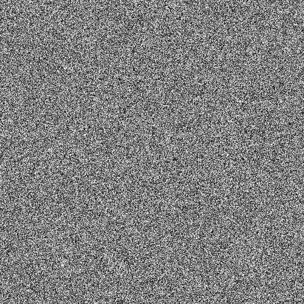
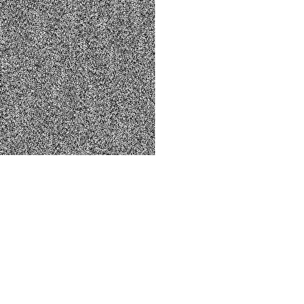
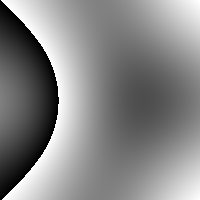
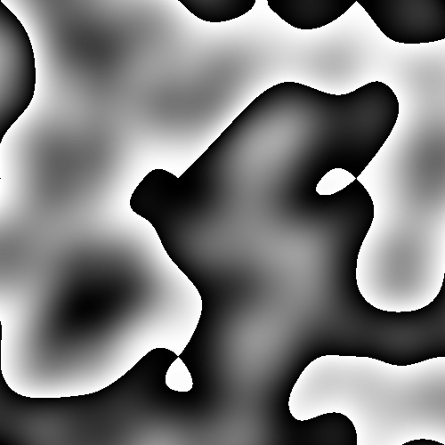
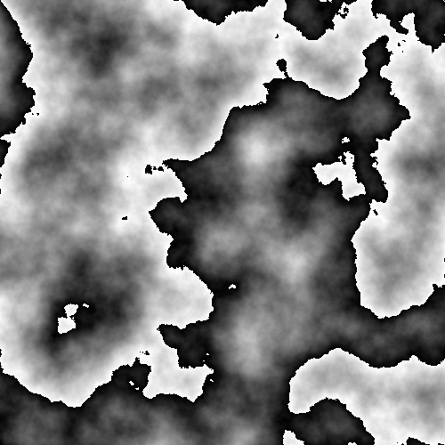

### 定义 Vector2

`Vector2` 表示坐标系里的一个点。
实现坐标点乘。


```kotlin
data class Vector2(val x: Double, val y: Double) {
    operator fun times(other: Vector2): Double {
        return this.x * other.x + this.y * other.y;
    }
}

// 测试
Vector2(1.0, 2.0) * Vector2(2.0, 1.0)
```


    4.0


```kotlin

USE {
    repositories {
        maven("https://s01.oss.sonatype.org/content/repositories/releases/")
    }

    dependencies {
        implementation("dev.yidafu.jupyter:jupyter-js:0.7.0")
    }
}
```

# 先实现生成 500 * 500 的灰度图


```kotlin
import java.awt.Color
import java.awt.image.BufferedImage
import java.io.ByteArrayOutputStream
import kotlin.random.Random
import java.io.IOException
import java.net.URL


val width: Int = 500;
val height: Int = 500;

val image = BufferedImage(width, height, BufferedImage.TYPE_INT_ARGB)

for (y in 0 until height) {
    for (x in 0 until width) {
        // 生成一个 0 到 255 之间的随机灰度值
        val grayValue = Random.nextInt(0, 256)
        // 设置像素的颜色
        image.setRGB(x, y, Color(grayValue, grayValue, grayValue).rgb)
    }
}

image
```


    

    


### 生成 `permutation table`

<https://cs.nyu.edu/~perlin/noise/> 

示例：
```js
[
   151,160,137,91,90,15,
   131,13,201,95,96,53,194,233,7,225,140,36,103,30,69,142,8,99,37,240,21,10,23,
   190, 6,148,247,120,234,75,0,26,197,62,94,252,219,203,117,35,11,32,57,177,33,
   88,237,149,56,87,174,20,125,136,171,168, 68,175,74,165,71,134,139,48,27,166,
   77,146,158,231,83,111,229,122,60,211,133,230,220,105,92,41,55,46,245,40,244,
   102,143,54, 65,25,63,161, 1,216,80,73,209,76,132,187,208, 89,18,169,200,196,
   135,130,116,188,159,86,164,100,109,198,173,186, 3,64,52,217,226,250,124,123,
   5,202,38,147,118,126,255,82,85,212,207,206,59,227,47,16,58,17,182,189,28,42,
   223,183,170,213,119,248,152, 2,44,154,163, 70,221,153,101,155,167, 43,172,9,
   129,22,39,253, 19,98,108,110,79,113,224,232,178,185, 112,104,218,246,97,228,
   251,34,242,193,238,210,144,12,191,179,162,241, 81,51,145,235,249,14,239,107,
   49,192,214, 31,181,199,106,157,184, 84,204,176,115,121,50,45,127, 4,150,254,
   138,236,205,93,222,114,67,29,24,72,243,141,128,195,78,66,215,61,156,180
]
```


```kotlin
// 为了方便观察，写死 permutation table
fun createPermutationTable(): List<Int> {
    val list = listOf(
     151,160,137,91,90,15,
   131,13,201,95,96,53,194,233,7,225,140,36,103,30,69,142,8,99,37,240,21,10,23,
   190, 6,148,247,120,234,75,0,26,197,62,94,252,219,203,117,35,11,32,57,177,33,
   88,237,149,56,87,174,20,125,136,171,168, 68,175,74,165,71,134,139,48,27,166,
   77,146,158,231,83,111,229,122,60,211,133,230,220,105,92,41,55,46,245,40,244,
   102,143,54, 65,25,63,161, 1,216,80,73,209,76,132,187,208, 89,18,169,200,196,
   135,130,116,188,159,86,164,100,109,198,173,186, 3,64,52,217,226,250,124,123,
   5,202,38,147,118,126,255,82,85,212,207,206,59,227,47,16,58,17,182,189,28,42,
   223,183,170,213,119,248,152, 2,44,154,163, 70,221,153,101,155,167, 43,172,9,
   129,22,39,253, 19,98,108,110,79,113,224,232,178,185, 112,104,218,246,97,228,
   251,34,242,193,238,210,144,12,191,179,162,241, 81,51,145,235,249,14,239,107,
   49,192,214, 31,181,199,106,157,184, 84,204,176,115,121,50,45,127, 4,150,254,
   138,236,205,93,222,114,67,29,24,72,243,141,128,195,78,66,215,61,156,180
    )
    return list + list
//     val list = MutableList<Int>(256) { it }
//     val list2 =  list.shuffled()
//     return (list2 + list2)
}

val P = createPermutationTable()
```

### 展示 permutation table


```kotlin
%use kandy(0.7.0)

import org.jetbrains.kotlinx.kandy.util.color.Color as KColor

val permutationData:  Map<String, List<Int>>  = mapOf(
    "index" to     (1..512).toList(),
    "permutation" to P,
);

plot(permutationData) {
    x("index")
    y("permutation")


    points {
        color = KColor.RED
        symbol = Symbol.CIRCLE
        size = 2.5
    }

    line {
        color = KColor.BLUE
    }
}
```


    null


### 展示 permutation table

直接 permutation table 转为灰度图

(x,y) 取值公式是：`V = P[ P[x] + y ]`。

会在 P 上的点，会跳一次。先取到 `x` 位置的值 V<sub>x</sub>，V<sub>x</sub> + y 位置的值 `V<sub>x2<sub>`。（x,y)对应的值就是 `V<sub>x2<sub>`

假设有 `P = [3,2,1,4, 232, ... ]`
    
（2, 1) 坐标对应的值就是 `P[ P[2] + 1 ]` ==> `P[ 1 + 1 ]` ==>  `P[ 2 ]` ==> `4`


```kotlin
val pImage = BufferedImage(width, height, BufferedImage.TYPE_INT_ARGB)

for (y in 0 until 255) {
    for (x in 0 until 255) {
        // 生成一个 0 到 255 之间的随机灰度值
        val grayValue = P[ P[x] + y ]
        // 设置像素的颜色
        pImage.setRGB(x, y, Color(grayValue, grayValue, grayValue).rgb)
    }
}

pImage
```


    

    


```kotlin
// 获取常数向量
fun GetConstantVector(v: Int): Vector2 {
    // v is the value from the permutation table
    val h = v and 3;
    return when(h) {
        0 -> Vector2(1.0, 1.0)
        1 -> Vector2(-1.0, 1.0);
        2 -> Vector2(-1.0, -1.0)
        else -> Vector2(1.0, -1.0)
    }
}
```


```kotlin
val xStart = mutableListOf<Int>()
val yStart = mutableListOf<Int>()
val xEnd = mutableListOf<Int>()
val yEnd = mutableListOf<Int>()
val vPoints = mutableListOf<Int>()

for (y in 0 until 20) {
    for (x in 0 until 20) {
        xStart.add(x)
        yStart.add(y)
        vPoints.add(P[P[x] + y] % 4)
//         val vector = GetConstantVector();
//         xEnd.add(x + vector.x.toInt())
//         yEnd.add(y + vector.y.toInt())
    }
}

val gridMap = mapOf(
    "xStart" to xStart,
    "yStart" to yStart,
    "vPoints" to vPoints,
)

plot(gridMap) {
    points  {
        x("xStart")
        y("yStart")
        color("vPoints")
    }
}
```


    null


### 平滑曲线辅助函数


### 编写 Noise2d_v1 函数


```kotlin
fun Fade(t: Double): Double {
    return 6*t*t*t*t*t - 15*t*t*t*t + 10*t*t*t;
}

fun Lerp(t: Double, a1: Double, a2: Double): Double {
    return a1 + t*(a2-a1);
}

// 差值 Lerp
val x: List<Double> = (0..100).step(1).map { it.toDouble() / 100.0 }
val y: List<Double> = x.map { Fade(it) }
val curveMap = mapOf("x" to x, "y" to y)

plot(curveMap) {
    x("x")
    y("y")
    line {
        color = KColor.GREEN
    }
}
```


    null


```kotlin
fun Noise2d_v1(x: Double, y: Double): Double {
    val X = floor(x).toInt() and 255 // 等价于取余 256
    val Y =  floor(y).toInt() and 255 // 等价于取余 256

    // decimal place
    val X_f = x - floor(x)
    val Y_f = y - floor(y)
    
    val topRight = Vector2(X_f - 1.0, Y_f - 1.0);
    val topLeft =  Vector2(X_f, Y_f - 1.0);
    val bottomRight = Vector2(X_f - 1.0, Y_f);
    val bottomLeft = Vector2(X_f, Y_f);

    val valueTopRight = P[P[X + 1] + Y + 1];
    val valueTopLeft = P[P[X] + Y + 1];
    val valueBottomRight = P[P[X + 1] + Y];
    val valueBottomLeft = P[P[X] + Y];
    
    val dotTopRight = topRight * GetConstantVector(valueTopRight)
    val dotTopLeft = topLeft * GetConstantVector(valueTopLeft)
    val dotBottomRight = bottomRight * GetConstantVector(valueBottomRight)
    val dotBottomLeft = bottomLeft * GetConstantVector(valueBottomLeft)

    val u = Fade(X_f);
    val v = Fade(Y_f);
    return Lerp(
        u,
        Lerp(v, dotBottomLeft, dotTopLeft),
        Lerp(v, dotBottomRight, dotTopRight)
    );
}

Noise2d_v1(100.5, 100.5)
```


    -0.25


```kotlin
import java.awt.Color

val height= 200
val width = 200
val image_v1 = BufferedImage(width, height, BufferedImage.TYPE_INT_ARGB)
for (y in 0 until height) {
    for (x in 0 until width) {
        // 生成一个 0 到 255 之间的随机灰度值
        val value = Noise2d_v1(x * 0.005, y * 0.005)
        
        val grayValue = (value * 255).toInt() and 255
        // 设置像素的颜色
        image_v1.setRGB(x, y, Color(grayValue, grayValue, grayValue).rgb)
    }
}

image_v1
```


    

    


```kotlin
fun FractalBrownianMotion(x: Int, y: Int, numOctaves: Int): Double {
    var result: Double = 0.0;
    var amplitude: Double = 1.0;
    var frequency: Double = 0.005;
    for(octave in 0..numOctaves) {
        val n = amplitude * Noise2d_v1(x * frequency, y * frequency);
        result += n;

        amplitude *= 0.5;
        frequency *= 2.0;
    }

    return result;
}

(FractalBrownianMotion(100, 100, 8) + 1.0) * 0.5
```


    0.25


```kotlin
val height= 500
val width = 500
val image_v2 = BufferedImage(width, height, BufferedImage.TYPE_INT_ARGB)
for (y in 0 until height) {
    for (x in 0 until width) {
        var n = 0.0;
        var  a = 1.0;
        // 这里限制只取 0~2.5格
        var  f = 0.005;
        for(o in 0..1) {
           var v = a * Noise2d_v1(x * f, y * f);
            n += v;
    
            a *= 0.5;
            f *= 2.0; 
        }

        n += 1.0;
        n *= 0.5;

        var value = Math.round(255 * n);
        val grayValue = value.toInt() * 2 and 255 
        // 设置像素的颜色
        image_v2.setRGB(x, y, Color(grayValue, grayValue, grayValue).rgb)
    }
}

image_v2
```


    

    


```kotlin
val height= 500
val width = 500
val image_v3 = BufferedImage(width, height, BufferedImage.TYPE_INT_ARGB)
for (y in 0 until height) {
    for (x in 0 until width) {
        var n = 0.0;
        var  a = 1.0;
        // 这里限制只取 0~2.5格
        var  f = 0.005;
        for(o in 0..8) {
           var v = a * Noise2d_v1(x * f, y * f);
            n += v;
    
            a *= 0.5;
            f *= 2.0; 
        }

        n += 1.0;
        n *= 0.5;

        var value = Math.round(255 * n);
        val grayValue = value.toInt() * 2 and 255 
        // 设置像素的颜色
        image_v3.setRGB(x, y, Color(grayValue, grayValue, grayValue).rgb)
    }
}

image_v3
```


    

    


从上面第一个没有分形迭代的图，可以猜测：生成结果与顶点的坐标有关系

如果我们在生成的图片画上网格，得到下面的图片。


```kotlin
%js

import './sample.js'
```


<div id="c1a01f86-1623-4b2e-a0eb-784934834491" style="width:100%;min-height:100px"></div>
<script type="module">
function getCellRoot(width = "100%", height = "100px") {
    var cellRoot = document.getElementById("c1a01f86-1623-4b2e-a0eb-784934834491");
    cellRoot.style = `width: ${width};height: ${height}`
    return cellRoot;
}

 const inline_Li9zYW1wbGUuanM = (function(exports = {}) {
    const matrix = [
        [
            17,
            182,
            189,
            28,
            42,
            223
        ],
        [
            119,
            248,
            152,
            2,
            44,
            154
        ],
        [
            147,
            118,
            126,
            255,
            82,
            85
        ],
        [
            40,
            244,
            102,
            143,
            54,
            65
        ],
        [
            245,
            40,
            244,
            102,
            143,
            54
        ],
        [
            225,
            140,
            36,
            103,
            30,
            69
        ]
    ];
    const gridSize = matrix.length;
    const canvas = getCellRoot('600px', '600px').appendChild(document.createElement('canvas'));
    canvas.width = 600;
    canvas.height = 600;
    let ctx = canvas.getContext('2d');
    ctx.fillStyle = '#000';
    const gridGap = 100;
    const halfGap = gridGap / 2;
    const qGap = gridGap / 4;
    ctx.lineWidth = gridGap / 100;
    ctx.font = "100px serif";
    function getDirection(direction) {
        direction = direction & 3;
        let vector = [
            0,
            0
        ];
        switch(direction){
            case 0:
                {
                    vector = [
                        1,
                        1
                    ];
                    break;
                }
            case 1:
                {
                    vector = [
                        -1,
                        1
                    ];
                    break;
                }
            case 2:
                {
                    vector = [
                        -1,
                        -1
                    ];
                    break;
                }
            case 3:
                {
                    vector = [
                        1,
                        -1
                    ];
                    break;
                }
        }
        return vector;
    }
    function Fade(t) {
        return 6 * t * t * t * t * t - 15 * t * t * t * t + 10 * t * t * t;
        ;
    }
    function Lerp(t, a1, a2) {
        return a1 + t * (a2 - a1);
    }
    function dot(m1, m2) {
        return m1[0] * m2[0] + m1[1] * m2[1];
    }
    function noise(x, y) {
        const X = Math.floor(x) & 255;
        const Y = Math.floor(y) & 255;
        const X_f = x - Math.floor(x);
        const Y_f = y - Math.floor(y);
        const topRight = [
            X_f - 1.0,
            Y_f - 1.0
        ];
        const topLeft = [
            X_f,
            Y_f - 1.0
        ];
        const bottomRight = [
            X_f - 1.0,
            Y_f
        ];
        const bottomLeft = [
            X_f,
            Y_f
        ];
        const valueTopRight = matrix[X + 1][Y + 1];
        const valueTopLeft = matrix[X][Y + 1];
        const valueBottomRight = matrix[X + 1][Y];
        const valueBottomLeft = matrix[X][Y];
        const dotTopRight = dot(topRight, getDirection(valueTopRight));
        const dotTopLeft = dot(topLeft, getDirection(valueTopLeft));
        const dotBottomRight = dot(bottomRight, getDirection(valueBottomRight));
        const dotBottomLeft = dot(bottomLeft, getDirection(valueBottomLeft));
        let u = Fade(X_f);
        let v = Fade(Y_f);
        return Lerp(u, Lerp(v, dotBottomLeft, dotTopLeft), Lerp(v, dotBottomRight, dotTopRight));
    }
    ctx.font = "16px serif";
    for(let i = 0; i < 500; i += 1){
        for(let j = 0; j < 500; j += 1){
            const x = i * 0.005;
            const y = j * 0.005;
            let value = noise(x, y);
            value += 1.0;
            value *= 0.5;
            const rgb = 255 - Math.round(255 * value);
            ctx.fillStyle = `rgb(${rgb}, ${rgb}, ${rgb})`;
            ctx.fillRect(x * gridGap + halfGap, y * gridGap + halfGap, halfGap / 100, halfGap / 100);
        }
    }
    ctx.lineWidth = gridGap / 100;
    for(let i = 0; i < gridSize; i++){
        for(let j = 0; j < gridSize; j++){
            const direction = matrix[i][j] & 3;
            ctx.strokeText(direction, i * gridGap + 40, j * gridGap + 70);
            let vector = getDirection(direction);
            ctx.fillStyle = 'red';
            ctx.strokeStyle = 'red';
            ctx.beginPath();
            ctx.moveTo(i * gridGap + halfGap, j * gridGap + halfGap);
            ctx.lineTo(i * gridGap + halfGap + vector[0] * qGap, j * gridGap + halfGap + vector[1] * qGap);
            ctx.closePath();
            ctx.stroke();
            ctx.beginPath();
            ctx.arc(i * gridGap + halfGap + vector[0] * qGap, j * gridGap + halfGap + vector[1] * qGap, halfGap / 10, 0, 2 * Math.PI);
            ctx.closePath();
            ctx.fill();
        }
    }
    for(let i = 0; i <= gridSize; i++){
        ctx.beginPath();
        ctx.moveTo(i * gridGap + halfGap, halfGap);
        ctx.lineTo(i * gridGap + halfGap, gridSize * gridGap + halfGap);
        ctx.closePath();
        ctx.stroke();
        ctx.beginPath();
        ctx.moveTo(halfGap, i * gridGap + halfGap);
        ctx.lineTo(gridSize * gridGap + halfGap, i * gridGap + halfGap);
        ctx.closePath();
        ctx.stroke();
    }
    return exports;
})();

</script>


观察网格内部的深色区域，都是向量指向的方向。

显然是一个格子的四个顶点的向量方向影响生产结果。对于一个格子，共有16种情况。


```kotlin
%js

import "./cell-grid-16-number.js"
```


<div id="6b11bd15-f799-4360-87ef-e46654e87282" style="width:100%;min-height:100px"></div>
<script type="module">
function getCellRoot(width = "100%", height = "100px") {
    var cellRoot = document.getElementById("6b11bd15-f799-4360-87ef-e46654e87282");
    cellRoot.style = `width: ${width};height: ${height}`
    return cellRoot;
}

 const inline_Li9jZWxsLWdyaWQtMTYtbnVtYmVyLmpz = (function(exports = {}) {
    function dot(m1, m2) {
        return m1[0] * m2[0] + m1[1] * m2[1];
    }
    function getDirection(direction) {
        direction = direction & 3;
        let vector = [
            0,
            0
        ];
        switch(direction){
            case 0:
                {
                    vector = [
                        1,
                        1
                    ];
                    break;
                }
            case 1:
                {
                    vector = [
                        -1,
                        1
                    ];
                    break;
                }
            case 2:
                {
                    vector = [
                        -1,
                        -1
                    ];
                    break;
                }
            case 3:
                {
                    vector = [
                        1,
                        -1
                    ];
                    break;
                }
        }
        return vector;
    }
    const CELL_SIZE = 100;
    function noiseV1(x, y, matrix) {
        const X = 0;
        const Y = 0;
        const X_f = x;
        const Y_f = y;
        const topRight = [
            X_f - 1.0,
            Y_f - 1.0
        ];
        const topLeft = [
            X_f,
            Y_f - 1.0
        ];
        const bottomRight = [
            X_f - 1.0,
            Y_f
        ];
        const bottomLeft = [
            X_f,
            Y_f
        ];
        const valueTopRight = matrix[X + 1][Y + 1];
        const valueTopLeft = matrix[X][Y + 1];
        const valueBottomRight = matrix[X + 1][Y];
        const valueBottomLeft = matrix[X][Y];
        const dotTopRight = dot(topRight, getDirection(valueTopRight));
        const dotTopLeft = dot(topLeft, getDirection(valueTopLeft));
        const dotBottomRight = dot(bottomRight, getDirection(valueBottomRight));
        const dotBottomLeft = dot(bottomLeft, getDirection(valueBottomLeft));
        return ((dotTopRight + dotBottomRight) + (dotTopLeft + dotBottomLeft));
    }
    const canvas = getCellRoot('800px', '800px').appendChild(document.createElement('canvas'));
    canvas.width = 800;
    canvas.height = 800;
    let ctx = canvas.getContext('2d');
    function renderGridCell(x, y, directions) {
        const gaps = [
            0.2,
            0.4,
            0.6,
            0.8
        ];
        for(let i = 0; i < gaps.length; i++){
            for(let j = 0; j < gaps.length; j++){
                const m = gaps[i];
                const n = gaps[j];
                const value = noiseV1(m, n, directions) + 5;
                const text = parseFloat(value.toFixed(1), 10);
                ctx.strokeText(text, x + m * CELL_SIZE, y + n * CELL_SIZE);
            }
        }
        ctx.strokeStyle = 'blue';
        ctx.fillStyle = 'blue';
        directions.forEach((row, i)=>{
            row.forEach((direction, j)=>{
                const vector = getDirection(direction);
                ctx.beginPath();
                const end = [
                    x + i * CELL_SIZE + vector[0] * CELL_SIZE / 4,
                    y + j * CELL_SIZE + vector[1] * CELL_SIZE / 4
                ];
                ctx.moveTo(x + i * CELL_SIZE, y + j * CELL_SIZE);
                ctx.lineTo(end[0], end[1]);
                ctx.closePath();
                ctx.stroke();
                ctx.beginPath();
                ctx.arc(end[0], end[1], CELL_SIZE / 20, 0, 2 * Math.PI);
                ctx.closePath();
                ctx.fill();
            });
        });
        ctx.strokeStyle = 'red';
        ctx.beginPath();
        ctx.moveTo(x, y);
        ctx.lineTo(x + CELL_SIZE, y);
        ctx.lineTo(x + CELL_SIZE, y + CELL_SIZE);
        ctx.lineTo(x, y + CELL_SIZE);
        ctx.closePath();
        ctx.stroke();
    }
    let count = 0;
    for(let i = 0; i < 2; i++){
        for(let j = 0; j < 2; j++){
            const col = i + j;
            for(let n = 0; n < 2; n++){
                for(let m = 0; m < 2; m++){
                    const row = count / 4 | 0;
                    const col = count % 4;
                    count++;
                    console.log([
                        i,
                        j
                    ], [
                        n,
                        m
                    ]);
                    renderGridCell(50 + 200 * row, 50 + 200 * col, [
                        [
                            n,
                            m
                        ],
                        [
                            i,
                            j
                        ]
                    ]);
                }
            }
        }
    }
    return exports;
})();

</script>


将数值转换为颜色，可以更直接看到顶点向量和内部颜色分布的关系


```kotlin
%js

import "./cell-grid-16-color.js"
```


<div id="173e9981-c118-4c05-ba3f-6960a3bf7375" style="width:100%;min-height:100px"></div>
<script type="module">
function getCellRoot(width = "100%", height = "100px") {
    var cellRoot = document.getElementById("173e9981-c118-4c05-ba3f-6960a3bf7375");
    cellRoot.style = `width: ${width};height: ${height}`
    return cellRoot;
}

const inline_Li9jZWxsLWdyaWQtMTYtY29sb3IuanM = (function(exports = {}) {
    function dot(m1, m2) {
        return m1[0] * m2[0] + m1[1] * m2[1];
    }
    function getDirection(direction) {
        direction = direction & 3;
        let vector = [
            0,
            0
        ];
        switch(direction){
            case 0:
                {
                    vector = [
                        1,
                        1
                    ];
                    break;
                }
            case 1:
                {
                    vector = [
                        -1,
                        1
                    ];
                    break;
                }
            case 2:
                {
                    vector = [
                        -1,
                        -1
                    ];
                    break;
                }
            case 3:
                {
                    vector = [
                        1,
                        -1
                    ];
                    break;
                }
        }
        return vector;
    }
    const CELL_SIZE = 100;
    function noiseV1(x, y, matrix) {
        const X = 0;
        const Y = 0;
        const X_f = x;
        const Y_f = y;
        const topRight = [
            X_f - 1.0,
            Y_f - 1.0
        ];
        const topLeft = [
            X_f,
            Y_f - 1.0
        ];
        const bottomRight = [
            X_f - 1.0,
            Y_f
        ];
        const bottomLeft = [
            X_f,
            Y_f
        ];
        const valueTopRight = matrix[X + 1][Y + 1];
        const valueTopLeft = matrix[X][Y + 1];
        const valueBottomRight = matrix[X + 1][Y];
        const valueBottomLeft = matrix[X][Y];
        const dotTopRight = dot(topRight, getDirection(valueTopRight));
        const dotTopLeft = dot(topLeft, getDirection(valueTopLeft));
        const dotBottomRight = dot(bottomRight, getDirection(valueBottomRight));
        const dotBottomLeft = dot(bottomLeft, getDirection(valueBottomLeft));
        return ((dotTopRight + dotBottomRight) + (dotTopLeft + dotBottomLeft));
    }
    const canvas = getCellRoot('800px', '800px').appendChild(document.createElement('canvas'));
    canvas.width = 800;
    canvas.height = 800;
    let ctx = canvas.getContext('2d');
    function renderGridCell(x, y, directions) {
        const gaps = [
            0,
            0.2,
            0.4,
            0.6,
            0.8
        ];
        for(let i = 0; i < gaps.length; i++){
            for(let j = 0; j < gaps.length; j++){
                const m = gaps[i];
                const n = gaps[j];
                const value = noiseV1(m, n, directions) + 5;
                const text = parseFloat(value.toFixed(1), 10);
                const rgb = text / 10 * 255 | 0;
                ctx.fillStyle = `rgb(${rgb}, ${rgb}, ${rgb})`;
                ctx.fillRect(x + m * CELL_SIZE, y + n * CELL_SIZE, CELL_SIZE / 5, CELL_SIZE / 5);
            }
        }
        ctx.strokeStyle = 'blue';
        ctx.fillStyle = 'blue';
        directions.forEach((row, i)=>{
            row.forEach((direction, j)=>{
                const vector = getDirection(direction);
                ctx.beginPath();
                const end = [
                    x + i * CELL_SIZE + vector[0] * CELL_SIZE / 4,
                    y + j * CELL_SIZE + vector[1] * CELL_SIZE / 4
                ];
                ctx.moveTo(x + i * CELL_SIZE, y + j * CELL_SIZE);
                ctx.lineTo(end[0], end[1]);
                ctx.closePath();
                ctx.stroke();
                ctx.beginPath();
                ctx.arc(end[0], end[1], CELL_SIZE / 20, 0, 2 * Math.PI);
                ctx.closePath();
                ctx.fill();
            });
        });
        ctx.strokeStyle = 'red';
        ctx.beginPath();
        ctx.moveTo(x, y);
        ctx.lineTo(x + CELL_SIZE, y);
        ctx.lineTo(x + CELL_SIZE, y + CELL_SIZE);
        ctx.lineTo(x, y + CELL_SIZE);
        ctx.closePath();
        ctx.stroke();
    }
    let count = 0;
    for(let i = 0; i < 2; i++){
        for(let j = 0; j < 2; j++){
            for(let n = 0; n < 2; n++){
                for(let m = 0; m < 2; m++){
                    const row = count / 4 | 0;
                    const col = count % 4;
                    count++;
                    console.log([
                        i,
                        j
                    ], [
                        n,
                        m
                    ]);
                    renderGridCell(50 + 200 * row, 50 + 200 * col, [
                        [
                            n,
                            m
                        ],
                        [
                            i,
                            j
                        ]
                    ]);
                }
            }
        }
    }
    return exports;
})();

</script>


```kotlin

```
