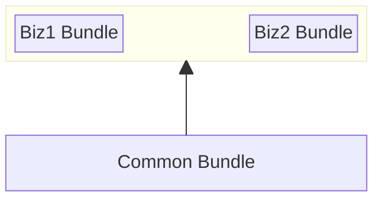
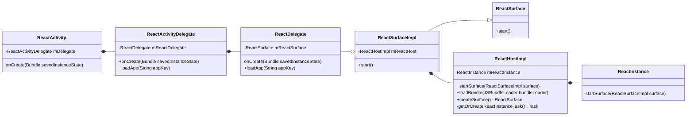

目前关于 React Native 分包方案的文章都比较老了，在 React Native 0.74+ 后开启 Bridgeless Mode 后不再有效。所以基于最新的 React Native 稳定版 0.77 记录一下如何实现 React Native 多包。

> 因为实际项目中只使用到 Android，后面的步骤中只针对 Android 进行，iOS 平台暂不做研究。

# 业务场景

原有RN项目有多个业务模块，且实现了热更新能力。在热更新时无法控制更新范围，只能多个业务模块进行捆绑更新。业务A提出，它需要能够独立更新，只有进入业务A页面时才触发更新，即有业务A权限的用户提示更新，没有业务A权限用户不用户弹更新提示。

需求实现的第一步，就需要先进行 RN 拆包工作。将业务A打包成 bundle，并放到单独 Activity 里运行，这样就业务A接入热更新能力后就可以做到单独发布更新了。

需要在 React Native 里实现多 activity 多 bundle 的运行模式。

粗暴的实现方式就是 React Native 多实例实现。各个实例之间互不关联、互不影响。这样就不要拆分公共 bundle，直接将项目打包成多个 bundle 文件即可。这样虽然 bundle 冗余公共代码，运行时对资源的消耗也较大，但是做法简单，维护成本较低，适合业务简单的场景。

进一步精细化，使用一个 React Native 实例，将拆分多个成多个 bundle，按需加载 bundle 在运行时执行。后面内容就是基于这个方案来的叙述。

# 实现步骤

## JS 分包

### 分包策略

需要将代码分成公共 bundle + 业务 bundle。



React Native 运行时先加载 Common Bundle，打开业务的 Activity 时再加载业务 Bundle。


### 公共分包

公共 bundle 打包不需要特殊处理，需要记录以来的`moduleId`，在后面构建业务 bundle 直接使用已生成公共依赖`moduleId`。

创建`index.common.js`，主要是引入公共依赖。

```js
import "react"
import "react-native"
// 共享的第三方库
import "other-dependencies"
// ...
// 项目的公共依赖
import "./common/shared.js"
```

> `relativePath` `appendBusinessBundle`等工具函数放在 github 仓库 [bundle.js](https://github.com/yidafu/react-native-multip-bundle/blob/main/bundle.js)

创建`metro.common.config.js`，保存 JS 文件路径跟 moduleId 的映射关系到本地文件里。

```js

const config = {
  // ...
  serializer: {
    createModuleIdFactory: () => {
      const bizModuleIdMap = new Map();
      let nextId = 1;

      return (path) => {
        const modulePath = relativePath(path);

        let moduleId = commonBundle.get(modulePath) ?? bizModuleIdMap.get(modulePath);
        if (typeof moduleId !== 'number') {
          // 从 1 开始自增 moduleId
          moduleId = nextId++;
          bizModuleIdMap.set(modulePath, moduleId);
          // 文件路径与 moduleId 的映射关系，方便下一步构建使用
          appendBusinessBundle(modulePath, moduleId);
        }

        return moduleId;
      };
    },
  },
};
```

通过下面命令生成 Common Bundle 即可:

```bash
npx react-native bundle --platform android --config metro.common.config.js \
  --dev false --entry-file index.common.js \
  --bundle-output ./android/app/src/main/assets/common.android.bundle \
  --assets-dest=./android/app/src/main/assets/ \
  --minify false --reset-cache
```

### 业务分包

对于业务 Bundle 打包需要做下列事情：

1. 需要剔除"prelude","polyfill"和 Common Bundle 的代码，即 Common Bundle 里的所有代码
2. 重新给`moduleId`编号，避免跟 Common Bundle 的 moduleId 重复

```js
// 读取 Common Bundle 的依赖文件跟 moduleId 的映射关系
const commonBundle = readCommonBundle();

const config = {
  // ...
  serializer: {
    createModuleIdFactory: () => {
      const bizModuleIdMap = new Map();
      // 根据入口JS文件获取 bundle 的 moduleId 起始值
      let nextId = getStartModuleId();

      return (path) => {
        const modulePath = relativePath(path);

        let moduleId = commonBundle.get(modulePath) ?? bizModuleIdMap.get(modulePath);
        if (typeof moduleId !== 'number') {
          moduleId = nextId++;
          bizModuleIdMap.set(modulePath, moduleId);
          appendBusinessBundle(modulePath, moduleId);
        }

        return moduleId;
      };
    },
    processModuleFilter(module) {
      // 过滤掉 prelude
      if (module['path'].includes('__prelude__')) {
        return false;
      }
      // 过滤掉 polyfill
      if (module.path.includes('polyfill')) {
        return false;
      }

      const modulePath = relativePath(module.path);
      // 过滤掉 common bundle 里的代码
      return !commonBundle.has(modulePath);
    },
  },
};
```

## Android 端

`ReactActivity` 实现 Bundle 加载和页面渲染的。在 [0.74+ 默认开启了 Bridgeless Mode](https://reactnative.dev/blog/2024/04/22/release-0.74#new-architecture-bridgeless-by-default) 后，原有加载 bundle 方式行不通了。


### Bridgeless

在 Bridgeless mode 里，原有的 `reactInstanceManager` 被废弃了，没有通过`catalystInstance#loadScriptFromAssets`上加载 Bundle。而新的 React Native 运行模式里没有提供加载 Bundle 方法。

分析新模式里的加载流程类图如下：



从`ReactActivity#onCreate`开始，一路委托给了`ReactDelegate#loadApp`进行加载应用。

```java
public void loadApp(String appKey) {
  if (ReactNativeFeatureFlags.enableBridgelessArchitecture()) {
      if (this.mReactSurface == null) {
          this.mReactSurface = this.mReactHost.createSurface(this.mActivity, appKey, this.mLaunchOptions);
      }

      this.mReactSurface.start();
  } else {
    // ..
  }
}
```

`ReactDelegate#loadApp`里通过`mReactHost#createSurface`创建`ReactSurface`实例`mReactSurface`。

`ReactSurface#start`方法也是转发调用，具体实现是`ReactHost#startSurface`。`ReactHost#startSurface`会创建`ReactInstance`实例，然后调用`ReactInstance#startSurface`方法。

Bundle 加载就发生在创建`ReactInstance`实例过程中。

[ReactHostImpl.java#L1158](https://github.com/facebook/react-native/blob/1498566c23a9820517740adf519b86a259ea7229/packages/react-native/ReactAndroid/src/main/java/com/facebook/react/runtime/)

```java
    @ThreadConfined("ReactHost")
    private Task<ReactInstance> getOrCreateReactInstanceTask() {
        
        return (Task)this.mCreateReactInstanceTaskRef.getOrCreate(() -> {
           
            Task<CreationResult> creationTask = this.getJsBundleLoader().onSuccess((task) -> {
                JSBundleLoader bundleLoader = (JSBundleLoader)task.getResult();
                
                ReactInstance instance = new ReactInstance(...);
                this.mReactInstance = instance;
                // ...
                instance.initializeEagerTurboModules();
                this.log("getOrCreateReactInstanceTask()", "Loading JS Bundle");
                instance.loadJSBundle(bundleLoader);
                // ...
                return new CreationResult(instance, reactContext, this.mReloadTask != null);
            }, this.mBGExecutor);
            // ...
        });
    }
```

React Native 通过 `instance.loadJSBundle(bundleLoader)`加载 Bundle。所以要加载自定义的Bundle，就需要去调用`ReactInstance#loadJSBundle`方法。

翻看`ReactHostImpl`类发现，它已经有了一个`loadBundle`方法。只要在`ReactActivity#onCreate`里通过`ReactHost`实例调用`loadBundle`方法即可实现加载自定义Bundle，但是这个方法不是公开，所以需要绕开访问权限限制。

```java
    Task<Boolean> loadBundle(JSBundleLoader bundleLoader) {
        String method = "loadBundle()";
        this.log("loadBundle()", "Schedule");
        return this.callWithExistingReactInstance("loadBundle()", (reactInstance) -> {
            this.log("loadBundle()", "Execute");
            reactInstance.loadJSBundle(bundleLoader);
        }, (Executor)null);
    }
```

借鉴 [ReactHostImplDevHelper](https://github.com/facebook/react-native/blob/main/packages/react-native/ReactAndroid/src/main/java/com/facebook/react/runtime/ReactHostImplDevHelper.kt)，需要在包`com.facebook.react.runtime`里创建一个 Helper 类型来间接调用`ReactHostImpl#loadBundle`方法

```kotlin
package com.facebook.react.runtime

import com.facebook.react.bridge.JSBundleLoader
import kotlin.jvm.internal.Intrinsics

class ReactHostHelper(
    private val delegate: ReactHostImpl,
) {
    fun loadBundle(bundleLoader: JSBundleLoader): Boolean? {
        Intrinsics.checkNotNullParameter(bundleLoader, "bundlerLoader")
        val task = delegate.loadBundle(bundleLoader)

        // 异步任务，阻塞到任务完成
        task.waitForCompletion()

        return task.getResult()
    }
}
```

所以在 Bridgeless 开启后的 Bundle加载方案

# Ref

+ [Demo Project](https://github.com/yidafu/react-native-multip-bundle)
+ <https://juejin.cn/post/7158793558713958430>
+ <https://varunon9.medium.com/loading-multiple-bundles-in-react-native-code-splitting-using-metro-44d45530e958>
+ [0.73: Introducing Bridgeless Mode](https://github.com/reactwg/react-native-new-architecture/discussions/154)
