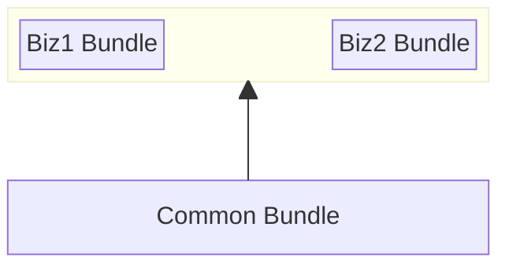

目前已有关于React Native分包方案的文章都比较老了，在 React Native 0.70+ 后的版本里不具有操作性。所以基于最新的 React Native 稳定版 0.77 记录一下如何实现 React Native 多包。

应为实际项目中只使用到 Android，后面的步骤中只针对 Android 进行，iOS 平台暂不做研究。

# 业务场景

原有RN项目有多个业务模块，且实现了热更新能力。在热更新时无法控制更新范围，只能多个业务模块进行捆绑更新。业务A提出，它需要能够独立更新，只有进入业务A页面时才触发更新，即有业务A权限的用户提示更新，没有业务A权限用户不用户弹更新提示。

需求实现的第一步，就需要先进行 RN 拆包工作。将业务A打包成 bundle，并放到单独 Activity 里运行，这样就业务A接入热更新能力后就可以做到单独发布更新了。

需要在 React Native 里实现多 activity 多 bundle 的运行模式。

粗暴的实现方式就是 React Native 多实例实现。各个实例之间互不关联、互不影响。这样就不要拆分公共 bundle，直接将项目打包成多个 bundle 文件即可。这样虽然 bundle 冗余公共代码，运行时对资源的消耗也较大，但是做法简单，维护成本较低，适合业务简单的场景。

进一步精细化，使用一个 React Native 实例，将拆分多个成多个 bundle，按需加载 bundle 在运行时执行。后面内容就是基于这个方案来的叙述。

# 实现步骤

## JS 分包

### 分包策略

需要将代码分成公共 bundle + 业务 bundle。



React Native 运行时先加载 Common Bundle，打开业务的 Activity 时再加载业务 Bundle。

### 分包实现

创建`index.common.js`，主要是引入公共依赖。

```js
import "react"
import "react-native"
// 共享的第三方库
import "other-dependencies"
// ...
// 项目的公共依赖
import "./common/shared.js"
```

创建`metro.common.config.js`

```js
const {getDefaultConfig, mergeConfig} = require('@react-native/metro-config');

/**
 * Metro configuration
 * https://reactnative.dev/docs/metro
 *
 * @type {import('@react-native/metro-config').MetroConfig}
 */
const config = {};

module.exports = mergeConfig(getDefaultConfig(__dirname), config);
```


## Ref

+ [Demo Project](https://github.com/yidafu/react-native-multip-bundle)
+ <https://juejin.cn/post/7158793558713958430>
+ <https://varunon9.medium.com/loading-multiple-bundles-in-react-native-code-splitting-using-metro-44d45530e958>
