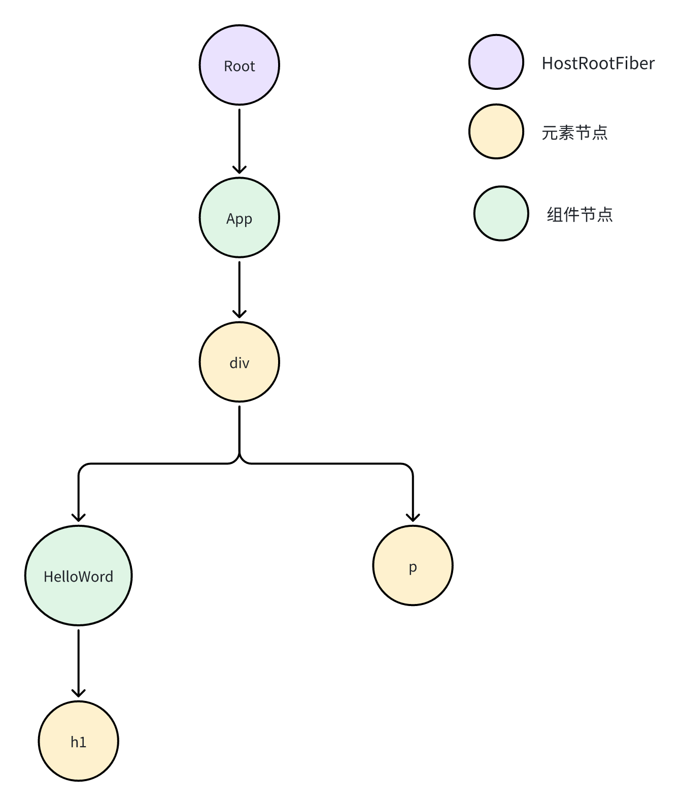
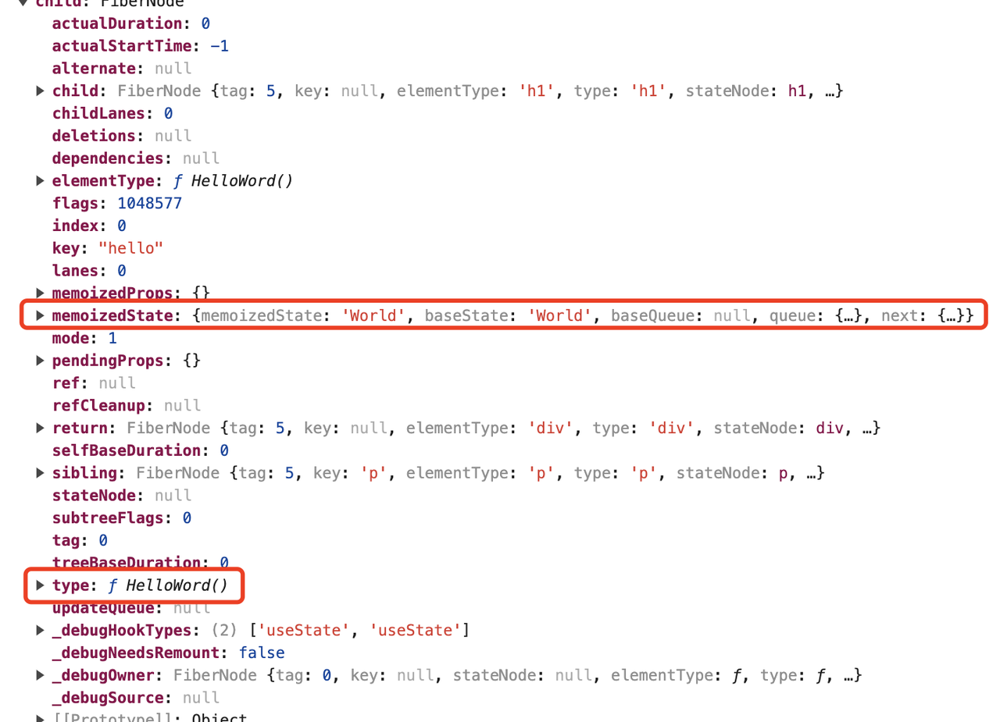
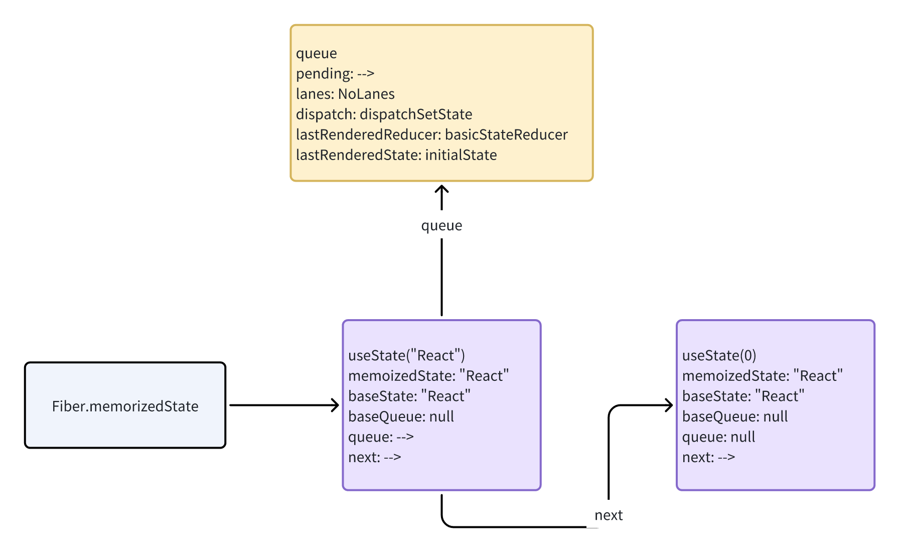
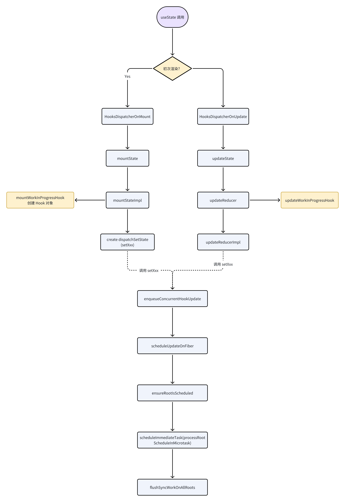

在hooks之前的函数组件都是纯函数，只用于由`props`数据渲染UI的场景。状态都是由类组件来实现的。

```typescript
// hooks 之前，函数组件是纯函数
function HookComponent(props) {
    return <div>{props.count}</div>
}
```

`useState()` 出现后，可以在函数组件里获取**组件状态**。解决了之前函数组件没有状态的问题。

hooks之后，函数组件几乎可以替换函数组件了。

```typescript
function HookComponent() {
    const [count, setCount] = useState(0)
    return <div onClick={() => setCount(count + 1)}>{count}</div>
}
```

那为什么函数组件可以拥有状态呢？

# 基本理念

## Function + State

众所周知，函数对比类最大的不同之一就是：函数是没有状态的。

类有属性保存状态。每次方法调用访问属性就是访问上次调用的计算结果。

```typescript
class Adder() {
    state: number = 0;
    add(num: number): void {
        this.state += num;
        console.log(this.state);
    }
}

const adder = new Adder()
adder.add(1); // 1
adder.add(2); // 3
```

而（纯）函数则做不到，需要将上次计算的结果当做参数传递进去。

```typescript
function add(state: number,  num: number): number {
    state += num;
    console.log(state);
    return state;
}

add(
    add(0, 1), // 1
    2,
); // 3
```

这就是 hooks 之前 React 函数的设计限制。设计上，函数组件是一个纯函数，只接受`props`返回 `ReactElement`，不可能额外传入外部状态，所以就不可能让函数拥有状态。

回到上面的例子，如何让`add`函数的调用解决与类的调用呢？

像下面这样：

```typescript
add(1); // 1
add(2); // 3
```

显而易见，这样设置一个全局变量`total`就能达到想要的结果。

```typescript
let state: number = 0;
function add(num: number) {
    total += num;
    console.log(total);
}

add(1); // 1
add(2); // 3
```

回到 React，类组件本身就可以在 state 属性保存状态，每次执行 render 函数再从 state 里读取状态。类组件实例化后，后面的渲染过程中组件实例一直存在的，所以能够从组件实例中获取状态。

```typescript
class ClassComponent extends React.Component {
    state = {
        count: 0,
    };

    render() {
        return <h1 onClick={() => this.setState({count: 1})}>{this.state.count}</h1>
    }
}

// 模拟 React 组件执行
const component = new ClassComponent()
component.render()
component.render()
```

但是函数组件每次需要都会重新执行，没有**组件实例**存在。所以，函数组件想要有状态，必须是**不纯的函数**，每次渲染时`useState`就需要从“全局变量”中获取组件状态。

## Fiber

前面的例子比较简单，只有一个有状态的函数，设置一个全局变量即可，但是在 React 我们的函数组件数量是不确定的，显然没法给每个函数组件都维护一个“全局变量”。

> 1. 没法区分两个函数组件，函数签名都一样
>
> 2. 函数组件是一颗树，更新时顺序是不固定的

为了解决让函数组件有状态这个难题，Fiber 出场了。

以下面的组件为例，React 渲染的时候会根据组件树生成对应的 FiberNode：

```typescript
function HelloWord() {
    const [text, setText] = React.useState('World');
    return <h1>Hello ${text}</h1>
}
function App() {
    const [text, setText] = React.useState('World');
    return <div>
        <HelloWord />
        <p>tips: react demo</>
    </div>
}
```

React 会渲染出下图所示的 Fiber Tree



> React 内部优化，只有个文本节点不会生成 FiberNode

创建 Fiber Tree 的时候，函数组件、HTML元素都会创建对应的 FiberNode。

FiberNode 作为React最小的执行单元，保存了组件的基本信息、状态、副作用。对于函数组件，**FiberNode 就是函数组件的实例**，保存函数组件执行的上下文信息。



上面 `type` 就是我们的函数组件，每次渲染都会执行 `type` 函数。

`memoizedState` 就是保存`useState`的“全局变量”。执行`useState`时就会从中读取 state 值。

# 源码探究

## 数据结构



### Fiber

Fiber.type 这个就是 `React.createElement` 的第一个参数。如何是函数组件`type`就是组件函数；如果是html标签就是标签字符串，如“div”/“h1”。

Fiber.memoizedProps 组件函数的 props 参数

Fiber.memoizedState 函数组件的状态，其类型是 `Hook`

### Hook

```typescript
export type Hook = {
  memoizedState: any,
  baseState: any,
  baseQueue: Update<any, any> | null,
  queue: any,
  next: Hook | null,
};
```

对于 useState hook，`memoizedState` 就是 state 的值。

`baseState`: 本次更新前该Fiber节点的state

`baseQueue` : 本次更新之前已有的待更新队列

`queue` 类型 UpdateQueue\<S, A>。更新队列，用于存放本次更新任务，会合并到baseQueue

`next` 下一个 Hook 对象指针。每个 hook 通过链表结构串在一起，这里就限制着hook声明顺序必须稳定。

### UpateQueue

```typescript
export type UpdateQueue<S, A> = {
  pending: Update<S, A> | null,
  lanes: Lanes,
  dispatch: (A => mixed) | null,
  lastRenderedReducer: ((S, A) => S) | null,
  lastRenderedState: S | null,
};
```

`pending` 本次更新需要添加的更新任务

`lanes`任务优先级

`dispatch` 就是 setXxx，保存下来给下次渲染的时候使用

`lastRenderedReducer`  保存 reducer，方便下次渲染时能够取到

`lastRenderedState`上次计算出的状态

```typescript
export type Update<S, A> = {
  lane: Lane,
  revertLane: Lane,
  action: A,
  hasEagerState: boolean,
  eagerState: S | null,
  next: Update<S, A>,
};
```

## 更新流程



### dispacher.useState

打开 packages/react/src/ReactHooks.js 可以看到 `useState`的实现入口。这里

```typescript
export function useState<S>(
  initialState: (() => S) | S,
): [S, Dispatch<BasicStateAction<S>>] {
  const dispatcher = resolveDispatcher();
  return dispatcher.useState(initialState);
}
```

而`resolveDispatcher`就是非常简单的获取`ReactCurrentDispatcher.current`

```typescript
function resolveDispatcher() {
  const dispatcher = ReactCurrentDispatcher.current;

  // Will result in a null access error if accessed outside render phase. We
  // intentionally don't throw our own error because this is in a hot path.
  // Also helps ensure this is inlined.
  return ((dispatcher: any): Dispatcher);
}
```

`ReactCurrentDispatcher.current`只有当 mount 时 `HooksDispatcherOnMount`，后面都是`HooksDispatcherOnUpdate`。

```typescript
    ReactCurrentDispatcher.current =
      current === null || current.memoizedState === null
        ? HooksDispatcherOnMount
        : HooksDispatcherOnUpdate;
```

`HooksDispatcherOnMount.useState`和`HooksDispatcherOnUpdate.useState`主要区别就是：

1. mount时会创建 Hook 对象挂载到 FiberNode上、创建 `dispatchSetState`，后续update时直接复用 dispatcher

2. mount 职责是初始化 state； update 则是调用`updateReducer`来更新 state

### mountState

Mount 时要挂载 `Hook` 对象到`FiberNode`的`memoizedState`，就需要找到当前组件对应的 `FiberNode`。React 处理也非常直接：声明全局变量`currentlyRenderingFiber`，在遍历 Fiber Tree 时`currentlyRenderingFiber`始终指向当前正在处理的 FiberNode。这个就可以在任意地方访问到当前的函数组件对应的 `FiberNode`。

```typescript
// The work-in-progress fiber. I've named it differently to distinguish it from
// the work-in-progress hook.
let currentlyRenderingFiber: Fiber = (null: any);
```

### dispatchSetState

`dispacher.useState` 返回的就数组`return [hook.memoizedState, dispatch];`。数组第一个值`hook.memoizedState` 就是我们的 state，第二个值`dispatch`就是`setXxx`。

其工作主要创建`Update`放入更新队列里面，还有就是触发React的下一次更新。

### basicStateReducers

在 React 除了 useState 还有一个钩子函数（useReducer）可以保持状态。从源码看，useState 只是『预制了 reducer 的 useReducer』。

useState 的 reducer 就是`basicStateReducer`。

```typescript
function basicStateReducer<S>(state: S, action: BasicStateAction<S>): S {
  // $FlowFixMe[incompatible-use]: Flow doesn't like mixed types
  return typeof action === 'function' ? action(state) : action;
}
```

完全可以使用 `useReducer` 来创建一个`useState`

```typescript
function mySetStateReducer(state: S, action: (s: S) => S): {
    return typeof action === 'function' ? action(state) : action;
}
function useMyState<S>(state: S) {
    const [mState, dispatch] = useRducer(mySetStateReducer, state)
    return [mState, dispatch]
}
```

# 总结

