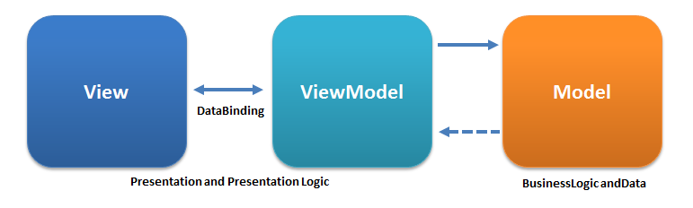
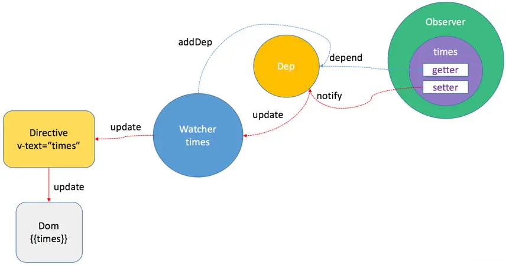
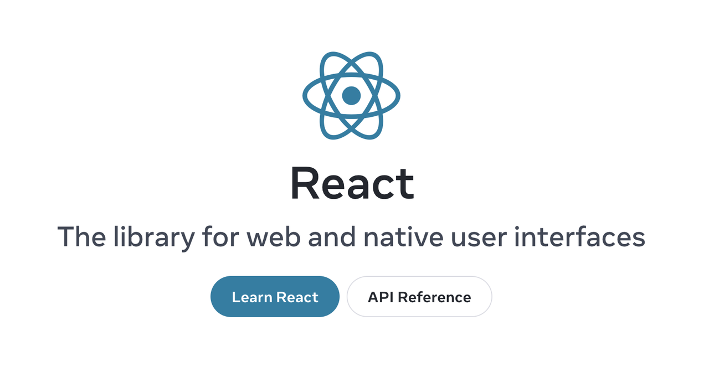
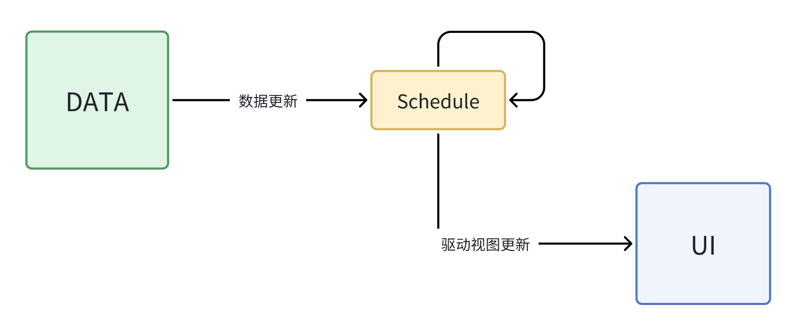
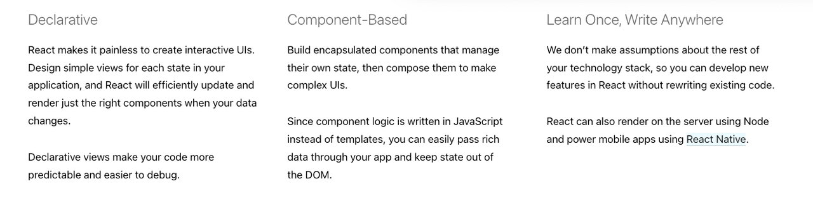
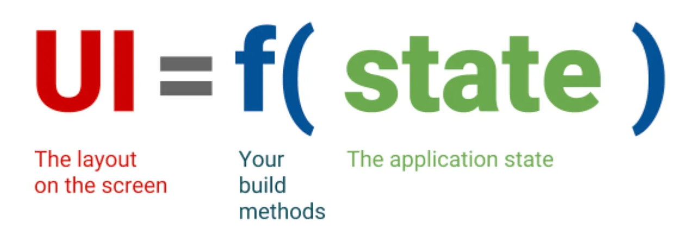
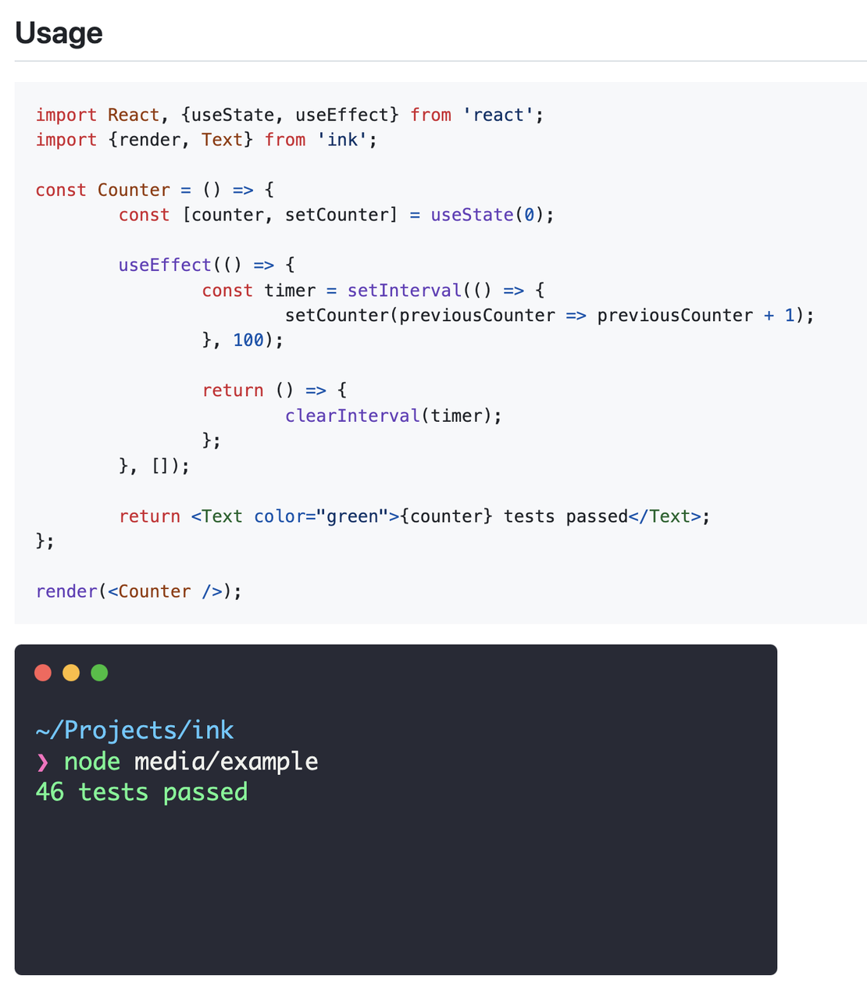
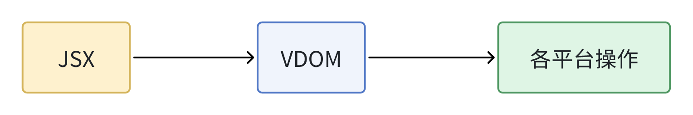

# React?

> React isn't react ?

什么意思？这种说法补充完整应该是“React is not reactive”

看一下官方是怎么说的？

> There is an internal joke in the team that React should have been called “Schedule” because React does not want to be fully “reactive”.
>
> \-- React Team

怎么理解呢？我们先搞清楚什么是 Reactive。

## Reactive UI

我们说的 Reactive 都是指的 Reactive UI，即以 MVVM 为标志的响应式 UI 编程。

简化一下，Reactive UI 就是 DATA 和 UI 上的双向绑定，DATA 会的 UI 更新，用户在 UI 交互（输入）会导致 DATA 变化。


这就是 Reactive UI / MVVM 带来的好处：视图和模型的同步更新。实现上，MVVM 有个 binder 组件，用户实现 Model 和 View 之间的**双向同步更新**。

> MVVM has a *binder*, which automates communication between the view and its bound properties in the view model.&#x20;



在前端框架实现没有 binder 这个实体，但这不是说没有 binder，我们应该加 binder 理解成一个抽象的东西。在 Vue 里基于 Proxy 的依赖收集机制就是事实上 binder。



## How to Re-act

在 React 是 MVVM 吗？当然不是。

React 官网说的很清楚，React 是一个 **library**。至少 React 官方对 React 是一个 UI 库，而非一个 MVVM framework 的。



我的理解，React 只干了一件事情就是数据驱动视图更新。

```plain&#x20;text
UI = fn(data)
```

从 MVVM 定义来说 React 缺失了重要的 VM/M，也没有双向绑定（binder）。

每次数据变更都是重新执行`fn`的过程，数据流动始终是**单向**的，所以 React 不是也不存在双向绑定。

所以 React 不是 Reactive UI。

## Reacting

那为什么 React 叫 React ？React 不是 Reactive，那是什么意思呢？也有人在 React Issue 提出了这个问题（[Where did the name React come from？ · Issue #14606 · facebook/react](https://github.com/facebook/react/issues/14606)) .&#x20;

React 官方在官方博客（[Our First 50,000 Stars – React Blog](https://legacy.reactjs.org/blog/2016/09/28/our-first-50000-stars.html#fbolt-is-born)）里回复了这个问题，这里摘抄最重要的一句话，这话完全解释了我们的疑问。

> **&#x20;This API reacts to any state or property changes, and works with data of any form (as deeply structured as the graph itself) so I think the name is fitting.**

总结一下，React 含义就是 Reacting Change。这个完全符合使用 React 给我们感受。

回到开头，这里可以给出回答了。

> &#x20;React isn't reactive.
>
> React is reacting.

React Team 的话又该如何理解？

前面说了 React 不是 MVVM 架构，从下面是 React 架构简图可以更直观地判断。



可以看到，在 DATA 和 UI 之间还有一个 Schedule，它占据了核心的地位：负责了驱动视图更新。这也是说 React Team 开玩笑说“schedule”这个名字更合适的原因。

至此，开头提出的问题就全部解答了，下面就我们来看一下 React 老官网介绍的 3 个特性。

# 特性

来自老官网的介绍。新官网更新了介绍，但核心的点还是这 3 个。



## Long Long Ago

开始讨论 React 特性之前，我们先回顾一下历史，古早时代前端开发会遇到什么问题？.&#x20;

早期主流都是使用 jQuery 开发，通过命令编程开发页面逻辑。当你的逻辑越来复杂，代码会变得越来越难以维护。

```javascript
// jQuery 官网示例
var hiddenBox = $( "#banner-message" );
$( "#button-container button" ).on( "click", function( event ) {
  hiddenBox.show();
});
```

面条式代码。事件响应和 UI 更新都混在一起，代码逻辑会变得混乱。复杂逻辑难以拆分、复用，

组件复用麻烦。一些 JQ 插件，只实现交互部分，需要开发者拷贝指定结构的模板 HTML 到项目里。或者 JQ 插件内部通过字符串模板创建 HTML 并插入，但这样定制性会大大降低。JQ 的组件还存在更大缺陷，组件间无法嵌套。

新 UI 框架出现解决了这些问题。下面会介绍 React 给前端开发带来哪些改变。

## 组件化

&#x20;上面提到 JQ 插件一种组件化的方式符串模板拼接。这个思路在后来的框架中比如 Angular 得到发展，模板字符串通过 AOT 编译处理成 JS 代码。

以 Angual 11 为例

```javascript
// app.components.js
import { Component, VERSION } from '@angular/core';

@Component({
  selector: 'my-app',
  templateUrl: './app.component.html',
  template: `<h2 class="title">Hello {{name}}</h2>`
  styleUrls: ['./app.component.css']
})
export class AppComponent {
  name = 'Angular ' + VERSION.full;
}
```

```html
// app.component.html
<h2 class="title">Hello {{name}}</h2>
```

会被编译成

```javascript
var AppComponent = /** @class */ (function () {
  function AppComponent() {
    this.name = 'Angular ' + core_1.VERSION.full;
  }
  AppComponent.ɵfac = function AppComponent_Factory(t) {
    return new (t || AppComponent)();
  };
  AppComponent.ɵcmp = i0.ɵɵdefineComponent({
    type: AppComponent,
    selectors: [["my-app"]],
    decls: 2,
    vars: 1,
    consts: [[1, "title"]],
    template: function AppComponent_Template(rf, ctx) {
      if (rf & 1) {
        i0.ɵɵelementStart(0, "h2", 0);
        i0.ɵɵtext(1);
        i0.ɵɵelementEnd();
      } if (rf & 2) {
        i0.ɵɵadvance(1);
        i0.ɵɵtextInterpolate1("Hello ", ctx.name, "");
      }
    },
    styles: [".title[_ngcontent-%COMP%] {\n  font-family: sans-serif;\n}"]
  });
  return AppComponent;
}());
```

这样写在模板的表达式也可以正常运行，本身就是 JS 表达式在 JS 自然可以运行。编译后的组件是一个个函数，函数天然可以嵌套，所以组件之间可以相互嵌套。

Vue 的模板跟 Angular 一脉相承。都是编写 HTML 模板，在模板里支持插值和 JS 表达式以支持动态化需求。但最终 HTML 模板都会被编译成 JS 代码。写法上依旧符合 HTML/JS/CSS 分离的原则，只是最后编译成 JS。

### JSX

既然模板最后都是 JS，那为什么不直接用 JS 来写 HTML 模板呢？

使用 JS 写 HTML 模板，最大的好处就是强大的视图动态性。完全不需要考虑为 HTML 模板支持 for 循环遍历，if 判断的能力，各种指令，插槽机制。

React 就是这么做的，所以发明了 JSX。

没有 JSX 我们要怎么写 React？我们需要调用`createElement`来创建`ReactElement`，创建出来的`ReactElement`会被渲染成对应的真实 DOM。如果我们真的使用`createElement`来写项目可以预想到，手写大量`createElement`编码效率低、代码嵌套层次也会很深。

```javascript
function App() {
    return React.createElement("div", {
        className: "header",
        "custom-attr": "1234"
    }, React.createElement("h1", null, "Helle React!"));
}
```

如果使用 JSX 的话，代码就会变得简洁起来。

```javascript
function App() {
    return (
        <div className="header" custom-attr="1234">
            <h1>Helle React!</h1>
        </div>
   )
}
```

所以，JSX 实际上就是一种语法糖。而且，相比较 Angular 的模板编译，JSX 只需要简单地转译即可，完全不需要非常重的编译器。

总结一下，JQ 时代没有好组件化方式，新的前端框架使用 HTML 模板和 JSX 的方式解决了组件化的问题。

## Declarative UI

UI 编程大趋势都是往声明式这个方向发展，前有 React，后来者有 Flutter、Compose、Ark UI。

那声明式 UI 有什么优势呢？

### 减少开发者关注内容

1. 使用命令式开发，需要关注状态、UI 结构、UI 更新逻辑。

2. 声明式只需要关注 状态、UI 结构

关注点分离，对前端开发者主要关注正确的状态和UI结构

### 提高可维护性&#x20;

如果使用命令式，来写 UI 可以兼职就是噩梦，想象一下使用 Canvas 来写业务页面时多么可怕的事情。

使用声明式 UI 可以大大提高编写 UI 的效率。

### 统一语言

上面提到使用命令式来写 UI 简直是噩梦。所以，像Android使用 XML 来描述UI结构，使用 Java 来操纵 UI 元素，而Web里，则是 HTML 的来描述UI结构，使用 JS 来操作 DOM。通过额外引入 HTML 来简化的 UI 编写。

HTML 实际上也是“声明式”，但是 HTML 声明的是静态UI，毕竟HTML不是编程语言，所以还是得命令式的方式来操作DOM。

现在的声明式UI，都采用的 DSL 来描述 UI，比起 HTML，DSL声明的UI是动态的，有状态的。

声明式UI，意味着开发者只需要表述状态和UI结构，至于怎么渲染则交由底层渲染引擎去实现。

就像下面的图展示的那样，开发者只需要实现 状态`state`和渲染函数`f`即可。



## 跨端

上面提到声明式UI的代码跟底层渲染引擎是分离的。如果有Web和Android原生两个渲染引擎，那有没有可能同一份代码既能在Web上运行，又能在Android等原生平台运行。

这就是React Native的理论支撑。

以 [GitHub - vadimdemedes/ink: 🌈 React for interactive command-line apps](https://github.com/vadimdemedes/ink) 为例，这个是库实现了 React 来写控制台UI。



Web里，React 渲染UI，不管中间如何处理，最后还是会调原生的API来插入真实DOM。而 React 将这些最后DOM操作进行了抽象，对于Web平台有一套基于JS DOM 实现，其他平台有特定平台一套原生API实现。

在ink [ink/src/reconciler.ts](https://github.com/vadimdemedes/ink/blob/master/src/reconciler.ts) 就针对控制实现了原生的UI操作，上层能则是完全使用React的能力。



# 参考

* https://dev.to/this-is-learning/how-react-isn-t-reactive-and-why-you-shouldn-t-care-152m

* [Design Principles – React](https://legacy.reactjs.org/docs/design-principles.html#scheduling)

* [The introduction to Reactive Programming you've been missing](https://gist.github.com/staltz/868e7e9bc2a7b8c1f754)  \[[中文翻译](https://zhuanlan.zhihu.com/p/27678951)]

* [wikipedia -- Model–view–viewmodel](https://en.wikipedia.org/wiki/Model%E2%80%93view%E2%80%93viewmodel)

* [Vue -- Reactivity in Depth](https://vuejs.org/guide/extras/reactivity-in-depth.html)

* [MVVM architectural pattern for a ReactJS application](https://stackoverflow.com/a/51507258)

* [github -- Where did the name React come from? #14606](https://github.com/facebook/react/issues/14606)

* [Angular -- Ahead-of-time (AOT) compilation](https://angular.io/guide/aot-compiler)

* [声明式 UI？Android 官方怒推的 Jetpack Compose 到底是什么](https://rengwuxian.com/jetpack-compose-3/)

* [未来属于声明式编程 | Randy's Blog](https://lutaonan.com/blog/declarative-programming-is-the-future/)

* [Declarative UI — What, How, and Why?](https://medium.com/israeli-tech-radar/declarative-ui-what-how-and-why-13e092a7516f)

