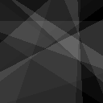
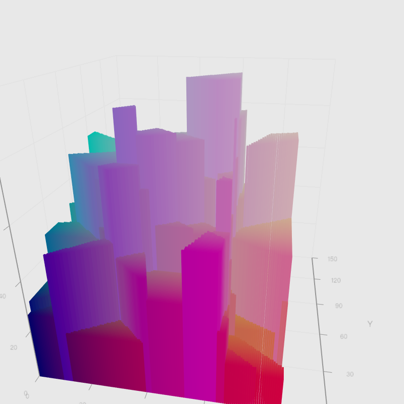

```kotlin
// 先引入要使用的库
%use kandy
%use lib-ext
%use dataframe
```

<div id="kotlin_out_0"></div>
<script type="text/javascript">
if(!window.kotlinQueues) {
window.kotlinQueues = {};
}
if(!window.kotlinQueues["kandyLetsPlot"]) {
var resQueue = [];
window.kotlinQueues["kandyLetsPlot"] = resQueue;
window["call_kandyLetsPlot"] = function(f) {
resQueue.push(f);
}
}
(function (){
var modifiers = [(function(script) {
script.src = "https://cdn.jsdelivr.net/gh/JetBrains/lets-plot@v3.1.0/js-package/distr/lets-plot.min.js"
script.type = "text/javascript";
})];
var e = document.getElementById("kotlin_out_0");
modifiers.forEach(function (gen) {
var script = document.createElement("script");
gen(script)
script.addEventListener("load", function() {
window["call_kandyLetsPlot"] = function(f) {f();};
window.kotlinQueues["kandyLetsPlot"].forEach(function(f) {f();});
window.kotlinQueues["kandyLetsPlot"] = [];
}, false);
script.addEventListener("error", function() {
window["call_kandyLetsPlot"] = function(f) {};
window.kotlinQueues["kandyLetsPlot"] = [];
var div = document.createElement("div");
div.style.color = 'darkred';
div.textContent = 'Error loading resource kandyLetsPlot';
document.getElementById("kotlin_out_0").appendChild(div);
}, false);

e.appendChild(script);
});
})();
</script>

<div id="kotlin_out_1"></div>
<script type="text/javascript">
if(!window.kotlinQueues) {
window.kotlinQueues = {};
}
if(!window.kotlinQueues["DataFrame"]) {
var resQueue = [];
window.kotlinQueues["DataFrame"] = resQueue;
window["call_DataFrame"] = function(f) {
resQueue.push(f);
}
}
(function (){
var modifiers = [(function(script) {
script.src = "https://cdn.jsdelivr.net/gh/Kotlin/dataframe@3db46ccccaa1291c0627307d64133317f545e6ae/core/src/main/resources/init.js"
script.type = "text/javascript";
})];
var e = document.getElementById("kotlin_out_1");
modifiers.forEach(function (gen) {
var script = document.createElement("script");
gen(script)
script.addEventListener("load", function() {
window["call_DataFrame"] = function(f) {f();};
window.kotlinQueues["DataFrame"].forEach(function(f) {f();});
window.kotlinQueues["DataFrame"] = [];
}, false);
script.addEventListener("error", function() {
window["call_DataFrame"] = function(f) {};
window.kotlinQueues["DataFrame"] = [];
var div = document.createElement("div");
div.style.color = 'darkred';
div.textContent = 'Error loading resource DataFrame';
document.getElementById("kotlin_out_1").appendChild(div);
}, false);

e.appendChild(script);
});
})();
</script>

<style>
:root {
    --background: #fff;
    --background-odd: #f5f5f5;
    --background-hover: #d9edfd;
    --header-text-color: #474747;
    --text-color: #848484;
    --text-color-dark: #000;
    --text-color-medium: #737373;
    --text-color-pale: #b3b3b3;
    --inner-border-color: #aaa;
    --bold-border-color: #000;
    --link-color: #296eaa;
    --link-color-pale: #296eaa;
    --link-hover: #1a466c;
}

:root[theme="dark"], :root [data-jp-theme-light="false"], .dataframe_dark{
    --background: #303030;
    --background-odd: #3c3c3c;
    --background-hover: #464646;
    --header-text-color: #dddddd;
    --text-color: #b3b3b3;
    --text-color-dark: #dddddd;
    --text-color-medium: #b2b2b2;
    --text-color-pale: #737373;
    --inner-border-color: #707070;
    --bold-border-color: #777777;
    --link-color: #008dc0;
    --link-color-pale: #97e1fb;
    --link-hover: #00688e;
}

p.dataframe_description {
    color: var(--text-color-dark);
}

table.dataframe {
    font-family: "Helvetica Neue", Helvetica, Arial, sans-serif;
    font-size: 12px;
    background-color: var(--background);
    color: var(--text-color-dark);
    border: none;
    border-collapse: collapse;
}

table.dataframe th, td {
    padding: 6px;
    border: 1px solid transparent;
    text-align: left;
}

table.dataframe th {
    background-color: var(--background);
    color: var(--header-text-color);
}

table.dataframe td {
    vertical-align: top;
}

table.dataframe th.bottomBorder {
    border-bottom-color: var(--bold-border-color);
}

table.dataframe tbody > tr:nth-child(odd) {
    background: var(--background-odd);
}

table.dataframe tbody > tr:nth-child(even) {
    background: var(--background);
}

table.dataframe tbody > tr:hover {
    background: var(--background-hover);
}

table.dataframe a {
    cursor: pointer;
    color: var(--link-color);
    text-decoration: none;
}

table.dataframe tr:hover > td a {
    color: var(--link-color-pale);
}

table.dataframe a:hover {
    color: var(--link-hover);
    text-decoration: underline;
}

table.dataframe img {
    max-width: fit-content;
}

table.dataframe th.complex {
    background-color: var(--background);
    border: 1px solid var(--background);
}

table.dataframe .leftBorder {
    border-left-color: var(--inner-border-color);
}

table.dataframe .rightBorder {
    border-right-color: var(--inner-border-color);
}

table.dataframe .rightAlign {
    text-align: right;
}

table.dataframe .expanderSvg {
    width: 8px;
    height: 8px;
    margin-right: 3px;
}

table.dataframe .expander {
    display: flex;
    align-items: center;
}

/* formatting */

table.dataframe .null {
    color: var(--text-color-pale);
}

table.dataframe .structural {
    color: var(--text-color-medium);
    font-weight: bold;
}

table.dataframe .dataFrameCaption {
    font-weight: bold;
}

table.dataframe .numbers {
    color: var(--text-color-dark);
}

table.dataframe td:hover .formatted .structural, .null {
    color: var(--text-color-dark);
}

table.dataframe tr:hover .formatted .structural, .null {
    color: var(--text-color-dark);
}


                </style>

根据 Fault Formation 算法,每次迭代在矩形内随机生成的一条直线，在直线右侧累加当前迭代的高度值。

比如迭代 2 次，随机生成恰好相交，矩形内就会出现 4 种不同的高度，如下图所示。

高度矩阵如下：

```txt
       0       0       0       0       0       0       0       0
      33       0       0       0       0       0       0       0
      33      33      33      33       0       0       0      66
      33      33      33      33      33      33     100      66
      33      33      33      33      33     100     100     100
      33      33      33      33     100     100     100     100
      33      33      33      33     100     100     100     100
      33      33      33     100     100     100     100     100
```

```kotlin
Image("./images/grid-8.png").withWidth(160)
```


随着迭代次数增加，可以预期随着直线不断生成，会出现某些位置频繁出现在直线右侧，使得该位置高度不断叠加，形成”高山“，某些位置频繁出现在直线左侧，形成“低谷”。

如下图，迭代 16 次就形成下面的不规则高度差。从 3D 图片更直观看出生成的 heightmap 比较接近大自然中高低起伏的山脉。

```kotlin
Image("./images/iteration-16.png").withWidth(512)
```



```kotlin
Image("./images/iteration-16-3d.png")
```



下面讨论一下迭代过程的高度计算。

根据每次迭代里计算高度的代码片段

```c
iHeight = iMaxDelta - ( ( iMaxDelta - iMinDelta) * iCurrentIteration ) / iIterations
```

可以得出`iHeight` 一个递减的序列，如下图红色点所示。

我们计算 heightmap 高度是将每次迭代的`iHeight`累加起来。请看书中 C 代码：

```c
fTempBuffer[(z * m_iSize) + x] += iHeight
```

累加起来的高度，开始会较快的变大，到后面变大的速度会变慢。如下图蓝色点所示。

反映到生成的 heightmap 就是，高度较高的区块高度差异不大，高度较低区块间高度差异大。

这是比较符合逻辑的，不太会存在一座较高的山比周围的山高出特别多。

```kotlin
val maxDelta = 255
val minDelta = 0;

val iterations = 32
val heights = mutableListOf<Float>()
val accumulateHeights = mutableListOf<Float>()
for (i in 0..iterations) {
    heights.add(
        maxDelta - ((maxDelta - minDelta) * i).toFloat() / iterations
    )
    accumulateHeights.add(heights.sum())
}
val index = (0..iterations).toList<Int>()

plot(mapOf(
    "index" to (0..iterations).toList<Int>(),
    "heights" to heights,
    "accHeights" to accumulateHeights
)) {
    points {
        x("index")
        y("heights")
        color = Color.RED
    }
       points {
        x("index")
        y("accHeights")
    }
}
```

<script type="text/javascript" data-lets-plot-script="library" src="https://cdn.jsdelivr.net/gh/JetBrains/lets-plot@v3.1.0/js-package/distr/lets-plot.min.js"></script>

    <div id="EolsSB"></div>

   <script type="text/javascript" data-lets-plot-script="plot">
       var plotSpec={
"mapping":{
},
"data":{
"heights":[255.0,247.03125,239.0625,231.09375,223.125,215.15625,207.1875,199.21875,191.25,183.28125,175.3125,167.34375,159.375,151.40625,143.4375,135.46875,127.5,119.53125,111.5625,103.59375,95.625,87.65625,79.6875,71.71875,63.75,55.78125,47.8125,39.84375,31.875,23.90625,15.9375,7.96875,0.0],
"index":[0.0,1.0,2.0,3.0,4.0,5.0,6.0,7.0,8.0,9.0,10.0,11.0,12.0,13.0,14.0,15.0,16.0,17.0,18.0,19.0,20.0,21.0,22.0,23.0,24.0,25.0,26.0,27.0,28.0,29.0,30.0,31.0,32.0],
"accHeights":[255.0,502.03125,741.09375,972.1875,1195.3125,1410.46875,1617.65625,1816.875,2008.125,2191.40625,2366.71875,2534.0625,2693.4375,2844.84375,2988.28125,3123.75,3251.25,3370.78125,3482.34375,3585.9375,3681.5625,3769.21875,3848.90625,3920.625,3984.375,4040.15625,4087.96875,4127.8125,4159.6875,4183.59375,4199.53125,4207.5,4207.5]
},
"kind":"plot",
"scales":[{
"aesthetic":"x",
"limits":[null,null]
},{
"aesthetic":"y",
"limits":[null,null]
},{
"aesthetic":"x",
"limits":[null,null]
},{
"aesthetic":"y",
"limits":[null,null]
}],
"layers":[{
"mapping":{
"x":"index",
"y":"heights"
},
"stat":"identity",
"color":"#ee6666",
"sampling":"none",
"position":"identity",
"geom":"point",
"data":{
}
},{
"mapping":{
"x":"index",
"y":"accHeights"
},
"stat":"identity",
"sampling":"none",
"position":"identity",
"geom":"point",
"data":{
}
}]
};
       var plotContainer = document.getElementById("EolsSB");
       LetsPlot.buildPlotFromProcessedSpecs(plotSpec, -1, -1, plotContainer);
   </script>

生成 heightmap 后，下一步就是不同高度差之间过滤变得平滑。

书中使用 FIR filter 算法。

为了简化问题，我们只考虑一维。下面给出了实际生成 heightmap 的第一行数据。

```kotlin
val samples = listOf<Double>(
    47.0,47.0,47.0,47.0,47.0,54.0,54.0,54.0,54.0,54.0,54.0,54.0,54.0,48.0,48.0,
    58.0,58.0,58.0,58.0,58.0,48.0,53.0,53.0,53.0,53.0,53.0,53.0,53.0,53.0,53.0,
    53.0,42.0,42.0,42.0,42.0,42.0,55.0,55.0,55.0,63.0,63.0,63.0,63.0,63.0,62.0,
    49.0,58.0,61.0,61.0,61.0,61.0,61.0,61.0,61.0,61.0,61.0,61.0,61.0,61.0,50.0,
    50.0,50.0,50.0,47.0
)
val listSize = samples.size
val gIndex = (0 until listSize).toList<Int>();

plot(mapOf(
    "points" to samples,
    "index" to gIndex,
)) {
    points {
        x("index")
        y("points")
    }
    line {
        x("index")
        y("points")
    }
}
```

<script type="text/javascript" data-lets-plot-script="library" src="https://cdn.jsdelivr.net/gh/JetBrains/lets-plot@v3.1.0/js-package/distr/lets-plot.min.js"></script>

    <div id="HqZ0Qf"></div>

   <script type="text/javascript" data-lets-plot-script="plot">
       var plotSpec={
"mapping":{
},
"data":{
"index":[0.0,1.0,2.0,3.0,4.0,5.0,6.0,7.0,8.0,9.0,10.0,11.0,12.0,13.0,14.0,15.0,16.0,17.0,18.0,19.0,20.0,21.0,22.0,23.0,24.0,25.0,26.0,27.0,28.0,29.0,30.0,31.0,32.0,33.0,34.0,35.0,36.0,37.0,38.0,39.0,40.0,41.0,42.0,43.0,44.0,45.0,46.0,47.0,48.0,49.0,50.0,51.0,52.0,53.0,54.0,55.0,56.0,57.0,58.0,59.0,60.0,61.0,62.0,63.0],
"points":[47.0,47.0,47.0,47.0,47.0,54.0,54.0,54.0,54.0,54.0,54.0,54.0,54.0,48.0,48.0,58.0,58.0,58.0,58.0,58.0,48.0,53.0,53.0,53.0,53.0,53.0,53.0,53.0,53.0,53.0,53.0,42.0,42.0,42.0,42.0,42.0,55.0,55.0,55.0,63.0,63.0,63.0,63.0,63.0,62.0,49.0,58.0,61.0,61.0,61.0,61.0,61.0,61.0,61.0,61.0,61.0,61.0,61.0,61.0,50.0,50.0,50.0,50.0,47.0]
},
"kind":"plot",
"scales":[{
"aesthetic":"x",
"limits":[null,null]
},{
"aesthetic":"y",
"limits":[null,null]
},{
"aesthetic":"x",
"limits":[null,null]
},{
"aesthetic":"y",
"limits":[null,null]
}],
"layers":[{
"mapping":{
"x":"index",
"y":"points"
},
"stat":"identity",
"sampling":"none",
"position":"identity",
"geom":"point",
"data":{
}
},{
"mapping":{
"x":"index",
"y":"points"
},
"stat":"identity",
"sampling":"none",
"position":"identity",
"geom":"line",
"data":{
}
}]
};
       var plotContainer = document.getElementById("HqZ0Qf");
       LetsPlot.buildPlotFromProcessedSpecs(plotSpec, -1, -1, plotContainer);
   </script>

下面直接根据书中代码给 FIR filter 实现。

```kt
// give number a,b
b = a * weight + (1 - weight) * b
```

其它核心想法是：将前后两个值（a,b)按权重混合（mixin）得到 b 的新值。然后 b 再跟 c 按权重混合得到 c 的新值。

这个权重就是下面函数参数`filter`。

如果`filter = 0`，那就表示不做平滑处理；`filter = 1`，就会将所有值都改初始值。

```kotlin
fun firFilter(band: MutableList<Double>, direction: Int, filter: Float) {
    val start: Int = if (direction == 1) 0 else {band.size - 1}
    var value = band[start]

    // val j = stride
    var i = start
    repeat(band.size) {
        band[i] = filter * value + (1 - filter) * band[i]
        value = band[i]
        i += direction
    }
}
```

给出`[1, 1, 3, 3, 3]` 5 个点，分别迭代 1 次、2 次、3 次。

从下图可以看出，每次迭代都会实现曲线更加平滑。

迭代次数过多，会导致曲线退化成执行。

```kotlin
val lines: List<Double> = listOf(1.0, 1.0, 3.0, 3.0, 3.0)

val index3: List<Double> = (0 until lines.size).map{ it.toDouble() }.toList<Double>();


val iterations = listOf(0,1,2,4,8,16,32,64,128).map { i ->
    val iteration: MutableList<Double> = lines.toMutableList()
    repeat(i) {
        firFilter(iteration, 1, 0.3f)
    }

    "iteration $i" to iteration
}.toMap().toMutableMap()
val keys = iterations.keys.toList()

iterations["xIndex"] = index3.toMutableList()
val itetationResults = keys.map {key ->
    plot(iterations) {
        points {
            x("xIndex")
            y(key)
        }
        line {
            x("xIndex")
            y(key)
        }
        layout.title = key
    }
}

plotGrid(itetationResults, nCol = 3)
```

<script type="text/javascript" data-lets-plot-script="library" src="https://cdn.jsdelivr.net/gh/JetBrains/lets-plot@v3.1.0/js-package/distr/lets-plot.min.js"></script>

    <div id="qgqFdM"></div>

   <script type="text/javascript" data-lets-plot-script="plot">
       var plotSpec={
"layout":{
"name":"grid",
"ncol":3,
"nrow":3,
"fit":true,
"align":false
},
"figures":[{
"ggtitle":{
"text":"iteration 0"
},
"mapping":{
},
"data":{
"xIndex":[0.0,1.0,2.0,3.0,4.0],
"iteration 0":[1.0,1.0,3.0,3.0,3.0]
},
"kind":"plot",
"scales":[{
"aesthetic":"x",
"limits":[null,null]
},{
"aesthetic":"y",
"limits":[null,null]
},{
"aesthetic":"x",
"limits":[null,null]
},{
"aesthetic":"y",
"limits":[null,null]
}],
"layers":[{
"mapping":{
"x":"xIndex",
"y":"iteration 0"
},
"stat":"identity",
"sampling":"none",
"position":"identity",
"geom":"point",
"data":{
}
},{
"mapping":{
"x":"xIndex",
"y":"iteration 0"
},
"stat":"identity",
"sampling":"none",
"position":"identity",
"geom":"line",
"data":{
}
}]
},{
"ggtitle":{
"text":"iteration 1"
},
"mapping":{
},
"data":{
"xIndex":[0.0,1.0,2.0,3.0,4.0],
"iteration 1":[1.0,1.0,2.399999976158142,2.819999985694885,2.9459999935626984]
},
"kind":"plot",
"scales":[{
"aesthetic":"x",
"limits":[null,null]
},{
"aesthetic":"y",
"limits":[null,null]
},{
"aesthetic":"x",
"limits":[null,null]
},{
"aesthetic":"y",
"limits":[null,null]
}],
"layers":[{
"mapping":{
"x":"xIndex",
"y":"iteration 1"
},
"stat":"identity",
"sampling":"none",
"position":"identity",
"geom":"point",
"data":{
}
},{
"mapping":{
"x":"xIndex",
"y":"iteration 1"
},
"stat":"identity",
"sampling":"none",
"position":"identity",
"geom":"line",
"data":{
}
}]
},{
"ggtitle":{
"text":"iteration 2"
},
"mapping":{
},
"data":{
"xIndex":[0.0,1.0,2.0,3.0,4.0],
"iteration 2":[1.0,1.0,1.9799999666213992,2.5679999699592586,2.832599981975555]
},
"kind":"plot",
"scales":[{
"aesthetic":"x",
"limits":[null,null]
},{
"aesthetic":"y",
"limits":[null,null]
},{
"aesthetic":"x",
"limits":[null,null]
},{
"aesthetic":"y",
"limits":[null,null]
}],
"layers":[{
"mapping":{
"x":"xIndex",
"y":"iteration 2"
},
"stat":"identity",
"sampling":"none",
"position":"identity",
"geom":"point",
"data":{
}
},{
"mapping":{
"x":"xIndex",
"y":"iteration 2"
},
"stat":"identity",
"sampling":"none",
"position":"identity",
"geom":"line",
"data":{
}
}]
},{
"ggtitle":{
"text":"iteration 4"
},
"mapping":{
},
"data":{
"iteration 4":[1.0,1.0,1.4801999672889719,2.0564399509334566,2.48861995584011],
"xIndex":[0.0,1.0,2.0,3.0,4.0]
},
"kind":"plot",
"scales":[{
"aesthetic":"x",
"limits":[null,null]
},{
"aesthetic":"y",
"limits":[null,null]
},{
"aesthetic":"x",
"limits":[null,null]
},{
"aesthetic":"y",
"limits":[null,null]
}],
"layers":[{
"mapping":{
"x":"xIndex",
"y":"iteration 4"
},
"stat":"identity",
"sampling":"none",
"position":"identity",
"geom":"point",
"data":{
}
},{
"mapping":{
"x":"xIndex",
"y":"iteration 4"
},
"stat":"identity",
"sampling":"none",
"position":"identity",
"geom":"line",
"data":{
}
}]
},{
"ggtitle":{
"text":"iteration 8"
},
"mapping":{
},
"data":{
"iteration 8":[1.0,1.0,1.1152960042921647,1.392006425588844,1.7655655091832647],
"xIndex":[0.0,1.0,2.0,3.0,4.0]
},
"kind":"plot",
"scales":[{
"aesthetic":"x",
"limits":[null,null]
},{
"aesthetic":"y",
"limits":[null,null]
},{
"aesthetic":"x",
"limits":[null,null]
},{
"aesthetic":"y",
"limits":[null,null]
}],
"layers":[{
"mapping":{
"x":"xIndex",
"y":"iteration 8"
},
"stat":"identity",
"sampling":"none",
"position":"identity",
"geom":"point",
"data":{
}
},{
"mapping":{
"x":"xIndex",
"y":"iteration 8"
},
"stat":"identity",
"sampling":"none",
"position":"identity",
"geom":"line",
"data":{
}
}]
},{
"ggtitle":{
"text":"iteration 16"
},
"mapping":{
},
"data":{
"xIndex":[0.0,1.0,2.0,3.0,4.0],
"iteration 16":[1.0,1.0,1.0066465843028696,1.0385501902243781,1.1199043885569504]
},
"kind":"plot",
"scales":[{
"aesthetic":"x",
"limits":[null,null]
},{
"aesthetic":"y",
"limits":[null,null]
},{
"aesthetic":"x",
"limits":[null,null]
},{
"aesthetic":"y",
"limits":[null,null]
}],
"layers":[{
"mapping":{
"x":"xIndex",
"y":"iteration 16"
},
"stat":"identity",
"sampling":"none",
"position":"identity",
"geom":"point",
"data":{
}
},{
"mapping":{
"x":"xIndex",
"y":"iteration 16"
},
"stat":"identity",
"sampling":"none",
"position":"identity",
"geom":"line",
"data":{
}
}]
},{
"ggtitle":{
"text":"iteration 32"
},
"mapping":{
},
"data":{
"iteration 32":[1.0,1.0,1.0000220885414475,1.0002341385477704,1.0012837861207775],
"xIndex":[0.0,1.0,2.0,3.0,4.0]
},
"kind":"plot",
"scales":[{
"aesthetic":"x",
"limits":[null,null]
},{
"aesthetic":"y",
"limits":[null,null]
},{
"aesthetic":"x",
"limits":[null,null]
},{
"aesthetic":"y",
"limits":[null,null]
}],
"layers":[{
"mapping":{
"x":"xIndex",
"y":"iteration 32"
},
"stat":"identity",
"sampling":"none",
"position":"identity",
"geom":"point",
"data":{
}
},{
"mapping":{
"x":"xIndex",
"y":"iteration 32"
},
"stat":"identity",
"sampling":"none",
"position":"identity",
"geom":"line",
"data":{
}
}]
},{
"ggtitle":{
"text":"iteration 64"
},
"mapping":{
},
"data":{
"iteration 64":[1.0,1.0,1.0000000002439517,1.0000000049278273,1.000000050595614],
"xIndex":[0.0,1.0,2.0,3.0,4.0]
},
"kind":"plot",
"scales":[{
"aesthetic":"x",
"limits":[null,null]
},{
"aesthetic":"y",
"limits":[null,null]
},{
"aesthetic":"x",
"limits":[null,null]
},{
"aesthetic":"y",
"limits":[null,null]
}],
"layers":[{
"mapping":{
"x":"xIndex",
"y":"iteration 64"
},
"stat":"identity",
"sampling":"none",
"position":"identity",
"geom":"point",
"data":{
}
},{
"mapping":{
"x":"xIndex",
"y":"iteration 64"
},
"stat":"identity",
"sampling":"none",
"position":"identity",
"geom":"line",
"data":{
}
}]
},{
"ggtitle":{
"text":"iteration 128"
},
"mapping":{
},
"data":{
"iteration 128":[1.0,1.0,1.0000000000000004,1.0000000000000009,1.000000000000001],
"xIndex":[0.0,1.0,2.0,3.0,4.0]
},
"kind":"plot",
"scales":[{
"aesthetic":"x",
"limits":[null,null]
},{
"aesthetic":"y",
"limits":[null,null]
},{
"aesthetic":"x",
"limits":[null,null]
},{
"aesthetic":"y",
"limits":[null,null]
}],
"layers":[{
"mapping":{
"x":"xIndex",
"y":"iteration 128"
},
"stat":"identity",
"sampling":"none",
"position":"identity",
"geom":"point",
"data":{
}
},{
"mapping":{
"x":"xIndex",
"y":"iteration 128"
},
"stat":"identity",
"sampling":"none",
"position":"identity",
"geom":"line",
"data":{
}
}]
}],
"kind":"subplots"
};
       var plotContainer = document.getElementById("qgqFdM");
       LetsPlot.buildPlotFromProcessedSpecs(plotSpec, -1, -1, plotContainer);
   </script>

修改`filter` 也会影响曲线的平滑度,`filter`越大就会越平滑。

```kotlin
val filterResults = listOf(0.0f, 0.3f, 0.6f, 0.9f, 0.98f, 1.0f).map { filter ->
    val list = lines.toMutableList();
    firFilter(list, 1, filter)
    filter to list;
}.map { (filter, list) ->
    "filter ${filter}" to list
}.toMap().toMutableMap()

val keys = filterResults.keys.toList();
val colors = listOf(Color.BLACK, Color.BLUE, Color.GREEN, Color.PURPLE, Color.RED, Color.YELLOW)

filterResults["xIndex"] = index3.toMutableList();

val filterPlots = keys.mapIndexed {i, key ->
    plot(filterResults) {
        points {
            x("xIndex")
            y(key)
//             color = colors[i]
        }
        line {
            x("xIndex")
            y(key)
//             color = colors[i]
        }
         layout.title = key
    }

}

plotGrid(filterPlots, nCol = 3)
```

<script type="text/javascript" data-lets-plot-script="library" src="https://cdn.jsdelivr.net/gh/JetBrains/lets-plot@v3.1.0/js-package/distr/lets-plot.min.js"></script>

    <div id="0ED8BE"></div>

   <script type="text/javascript" data-lets-plot-script="plot">
       var plotSpec={
"layout":{
"name":"grid",
"ncol":3,
"nrow":2,
"fit":true,
"align":false
},
"figures":[{
"ggtitle":{
"text":"filter 0.0"
},
"mapping":{
},
"data":{
"xIndex":[0.0,1.0,2.0,3.0,4.0],
"filter 0.0":[1.0,1.0,3.0,3.0,3.0]
},
"kind":"plot",
"scales":[{
"aesthetic":"x",
"limits":[null,null]
},{
"aesthetic":"y",
"limits":[null,null]
},{
"aesthetic":"x",
"limits":[null,null]
},{
"aesthetic":"y",
"limits":[null,null]
}],
"layers":[{
"mapping":{
"x":"xIndex",
"y":"filter 0.0"
},
"stat":"identity",
"sampling":"none",
"position":"identity",
"geom":"point",
"data":{
}
},{
"mapping":{
"x":"xIndex",
"y":"filter 0.0"
},
"stat":"identity",
"sampling":"none",
"position":"identity",
"geom":"line",
"data":{
}
}]
},{
"ggtitle":{
"text":"filter 0.3"
},
"mapping":{
},
"data":{
"xIndex":[0.0,1.0,2.0,3.0,4.0],
"filter 0.3":[1.0,1.0,2.399999976158142,2.819999985694885,2.9459999935626984]
},
"kind":"plot",
"scales":[{
"aesthetic":"x",
"limits":[null,null]
},{
"aesthetic":"y",
"limits":[null,null]
},{
"aesthetic":"x",
"limits":[null,null]
},{
"aesthetic":"y",
"limits":[null,null]
}],
"layers":[{
"mapping":{
"x":"xIndex",
"y":"filter 0.3"
},
"stat":"identity",
"sampling":"none",
"position":"identity",
"geom":"point",
"data":{
}
},{
"mapping":{
"x":"xIndex",
"y":"filter 0.3"
},
"stat":"identity",
"sampling":"none",
"position":"identity",
"geom":"line",
"data":{
}
}]
},{
"ggtitle":{
"text":"filter 0.6"
},
"mapping":{
},
"data":{
"filter 0.6":[1.0,1.0,1.7999999523162842,2.27999994277954,2.567999948501585],
"xIndex":[0.0,1.0,2.0,3.0,4.0]
},
"kind":"plot",
"scales":[{
"aesthetic":"x",
"limits":[null,null]
},{
"aesthetic":"y",
"limits":[null,null]
},{
"aesthetic":"x",
"limits":[null,null]
},{
"aesthetic":"y",
"limits":[null,null]
}],
"layers":[{
"mapping":{
"x":"xIndex",
"y":"filter 0.6"
},
"stat":"identity",
"sampling":"none",
"position":"identity",
"geom":"point",
"data":{
}
},{
"mapping":{
"x":"xIndex",
"y":"filter 0.6"
},
"stat":"identity",
"sampling":"none",
"position":"identity",
"geom":"line",
"data":{
}
}]
},{
"ggtitle":{
"text":"filter 0.9"
},
"mapping":{
},
"data":{
"filter 0.9":[1.0,1.0,1.2000000476837158,1.3800000858306873,1.5420001158714263],
"xIndex":[0.0,1.0,2.0,3.0,4.0]
},
"kind":"plot",
"scales":[{
"aesthetic":"x",
"limits":[null,null]
},{
"aesthetic":"y",
"limits":[null,null]
},{
"aesthetic":"x",
"limits":[null,null]
},{
"aesthetic":"y",
"limits":[null,null]
}],
"layers":[{
"mapping":{
"x":"xIndex",
"y":"filter 0.9"
},
"stat":"identity",
"sampling":"none",
"position":"identity",
"geom":"point",
"data":{
}
},{
"mapping":{
"x":"xIndex",
"y":"filter 0.9"
},
"stat":"identity",
"sampling":"none",
"position":"identity",
"geom":"line",
"data":{
}
}]
},{
"ggtitle":{
"text":"filter 0.98"
},
"mapping":{
},
"data":{
"xIndex":[0.0,1.0,2.0,3.0,4.0],
"filter 0.98":[1.0,1.0,1.0399999618530273,1.0791999252319329,1.1176158900909403]
},
"kind":"plot",
"scales":[{
"aesthetic":"x",
"limits":[null,null]
},{
"aesthetic":"y",
"limits":[null,null]
},{
"aesthetic":"x",
"limits":[null,null]
},{
"aesthetic":"y",
"limits":[null,null]
}],
"layers":[{
"mapping":{
"x":"xIndex",
"y":"filter 0.98"
},
"stat":"identity",
"sampling":"none",
"position":"identity",
"geom":"point",
"data":{
}
},{
"mapping":{
"x":"xIndex",
"y":"filter 0.98"
},
"stat":"identity",
"sampling":"none",
"position":"identity",
"geom":"line",
"data":{
}
}]
},{
"ggtitle":{
"text":"filter 1.0"
},
"mapping":{
},
"data":{
"xIndex":[0.0,1.0,2.0,3.0,4.0],
"filter 1.0":[1.0,1.0,1.0,1.0,1.0]
},
"kind":"plot",
"scales":[{
"aesthetic":"x",
"limits":[null,null]
},{
"aesthetic":"y",
"limits":[null,null]
},{
"aesthetic":"x",
"limits":[null,null]
},{
"aesthetic":"y",
"limits":[null,null]
}],
"layers":[{
"mapping":{
"x":"xIndex",
"y":"filter 1.0"
},
"stat":"identity",
"sampling":"none",
"position":"identity",
"geom":"point",
"data":{
}
},{
"mapping":{
"x":"xIndex",
"y":"filter 1.0"
},
"stat":"identity",
"sampling":"none",
"position":"identity",
"geom":"line",
"data":{
}
}]
}],
"kind":"subplots"
};
       var plotContainer = document.getElementById("0ED8BE");
       LetsPlot.buildPlotFromProcessedSpecs(plotSpec, -1, -1, plotContainer);
   </script>

根据上面给出的公式，我们有以下推论：

1. 对于给定数组，重复执行`firFilter`将会得到更加平滑的结果。
2. `firFilter`执行跟方向有关， 为了得到平滑的结果从左到右和从右到左都要执行

下面给出四种情况的结果对比：

1. 从左到右执行 1 次
1. 从左到右执行 4 次
1. 从左到右和从右到左执行 1 次
1. 从左到右和从右到左执行 4 次

```kotlin
// left to right
val oneTimes = samples.toMutableList()
firFilter(oneTimes, 1, 0.6f)

// left to right 4 time
val fourTimes = samples.toMutableList()
repeat(4) {
    firFilter(fourTimes,1, 0.6f)
}

// left to right and right to left
var towDirection = samples.toMutableList()
firFilter(towDirection, 1, 0.6f)
firFilter(towDirection, -1, 0.6f)

// left to right and right to left 4 times
var towDirectionFourTime = samples.toMutableList()
repeat(4) {
    firFilter(towDirectionFourTime, 1, 0.6f)
    firFilter(towDirectionFourTime, -1, 0.6f)
}

val plotList = listOf(
    oneTimes to Color.BLUE,
    fourTimes to Color.GREEN,
    towDirection to Color.PURPLE,
    towDirectionFourTime to Color.RED,
).map {(list, c) ->
    plot(mapOf(
        "points" to list,
        "index" to gIndex,
    )) {
        line {
            x("index")
            y("points")
            color = c
        }
        points {
            x("index")
            y("points")
            color = c
        }
    }
}

plotGrid(plotList, nCol = 2)
```

<script type="text/javascript" data-lets-plot-script="library" src="https://cdn.jsdelivr.net/gh/JetBrains/lets-plot@v3.1.0/js-package/distr/lets-plot.min.js"></script>

    <div id="ZRx3qU"></div>

   <script type="text/javascript" data-lets-plot-script="plot">
       var plotSpec={
"layout":{
"name":"grid",
"ncol":2,
"nrow":2,
"fit":true,
"align":false
},
"figures":[{
"layers":[{
"mapping":{
"x":"index",
"y":"points"
},
"stat":"identity",
"color":"#5470c6",
"sampling":"none",
"position":"identity",
"geom":"line",
"data":{
}
},{
"mapping":{
"x":"index",
"y":"points"
},
"stat":"identity",
"color":"#5470c6",
"sampling":"none",
"position":"identity",
"geom":"point",
"data":{
}
}],
"mapping":{
},
"data":{
"index":[0.0,1.0,2.0,3.0,4.0,5.0,6.0,7.0,8.0,9.0,10.0,11.0,12.0,13.0,14.0,15.0,16.0,17.0,18.0,19.0,20.0,21.0,22.0,23.0,24.0,25.0,26.0,27.0,28.0,29.0,30.0,31.0,32.0,33.0,34.0,35.0,36.0,37.0,38.0,39.0,40.0,41.0,42.0,43.0,44.0,45.0,46.0,47.0,48.0,49.0,50.0,51.0,52.0,53.0,54.0,55.0,56.0,57.0,58.0,59.0,60.0,61.0,62.0,63.0],
"points":[47.0,47.0,47.0,47.0,47.0,49.799999833106995,51.47999979972839,52.487999819755544,53.09279985580443,53.45567989185332,53.67340792213439,53.80404474549407,53.882426842624504,51.529456245822686,50.117673831642406,53.270604111056144,55.162362353876105,56.29741734467111,56.978450366209934,57.38707019537032,53.632242341027386,53.37934541969026,53.227607260858456,53.13656436194165,53.08193862042094,53.049163174206136,53.02949790569582,53.01769874412078,53.010619246894436,53.00637154838984,53.003822929185816,48.60229401986307,45.9613765693288,44.37682603604385,43.42609567829426,42.855657440977325,47.71339417504271,50.628036331299406,52.37682169454391,56.62609276345003,59.17565550610423,60.70539321248306,61.623235872782146,62.173941490844676,62.10436489865389,56.86261925162474,57.31757152385757,58.79054282651861,59.6743256432336,60.20459535433362,60.522757193636245,60.71365430480339,60.828192576055024,60.896915541536806,60.93814932246436,60.96288959200398,60.97773375431761,60.9866402520597,60.9919841509173,56.5951907526197,53.95711460881342,52.37426885963302,51.42456137238679,49.654736928921835]
},
"kind":"plot",
"scales":[{
"aesthetic":"x",
"limits":[null,null]
},{
"aesthetic":"y",
"limits":[null,null]
},{
"aesthetic":"x",
"limits":[null,null]
},{
"aesthetic":"y",
"limits":[null,null]
}]
},{
"layers":[{
"mapping":{
"x":"index",
"y":"points"
},
"stat":"identity",
"color":"#3ba272",
"sampling":"none",
"position":"identity",
"geom":"line",
"data":{
}
},{
"mapping":{
"x":"index",
"y":"points"
},
"stat":"identity",
"color":"#3ba272",
"sampling":"none",
"position":"identity",
"geom":"point",
"data":{
}
}],
"mapping":{
},
"data":{
"index":[0.0,1.0,2.0,3.0,4.0,5.0,6.0,7.0,8.0,9.0,10.0,11.0,12.0,13.0,14.0,15.0,16.0,17.0,18.0,19.0,20.0,21.0,22.0,23.0,24.0,25.0,26.0,27.0,28.0,29.0,30.0,31.0,32.0,33.0,34.0,35.0,36.0,37.0,38.0,39.0,40.0,41.0,42.0,43.0,44.0,45.0,46.0,47.0,48.0,49.0,50.0,51.0,52.0,53.0,54.0,55.0,56.0,57.0,58.0,59.0,60.0,61.0,62.0,63.0],
"points":[47.0,47.0,47.0,47.0,47.0,47.179199957275394,47.609279871826175,48.25439976928712,49.02854367700196,49.84139481240235,50.62173193339453,51.324035370194515,51.926009768514824,52.269038703484426,52.297701911192824,52.31063839524613,52.49813456535928,52.90049104111009,53.468617232898495,54.12335023237007,54.5348934117701,54.67508934048422,54.61468645743815,54.43761624144905,54.2109112362578,53.978933406688704,53.766708973764096,53.58551762200121,53.438015276740515,53.32208538454476,53.233413667596025,52.885450554068214,52.16082284043461,51.11172878740001,49.869950636322756,48.574743897423055,47.66878293742828,47.35518948585599,47.601316719431026,48.4592924211788,49.83326710504373,51.530874487238265,53.34673981353244,55.1139051326131,56.69589846226322,57.691703168316074,58.186423473271915,58.43743163602288,58.62660430741789,58.83682314619543,59.08549069337934,59.359134646995926,59.63587053341462,59.89657012096808,60.12870067866116,60.32633845773778,60.48864659582195,60.61806265980894,60.71875055601548,60.51388325100691,59.89549618093341,58.9241025959037,57.73841955065447,56.40645477242008]
},
"kind":"plot",
"scales":[{
"aesthetic":"x",
"limits":[null,null]
},{
"aesthetic":"y",
"limits":[null,null]
},{
"aesthetic":"x",
"limits":[null,null]
},{
"aesthetic":"y",
"limits":[null,null]
}]
},{
"layers":[{
"mapping":{
"x":"index",
"y":"points"
},
"stat":"identity",
"color":"#9a60b4",
"sampling":"none",
"position":"identity",
"geom":"line",
"data":{
}
},{
"mapping":{
"x":"index",
"y":"points"
},
"stat":"identity",
"color":"#9a60b4",
"sampling":"none",
"position":"identity",
"geom":"point",
"data":{
}
}],
"mapping":{
},
"data":{
"index":[0.0,1.0,2.0,3.0,4.0,5.0,6.0,7.0,8.0,9.0,10.0,11.0,12.0,13.0,14.0,15.0,16.0,17.0,18.0,19.0,20.0,21.0,22.0,23.0,24.0,25.0,26.0,27.0,28.0,29.0,30.0,31.0,32.0,33.0,34.0,35.0,36.0,37.0,38.0,39.0,40.0,41.0,42.0,43.0,44.0,45.0,46.0,47.0,48.0,49.0,50.0,51.0,52.0,53.0,54.0,55.0,56.0,57.0,58.0,59.0,60.0,61.0,62.0,63.0],
"points":[47.3380801830978,47.56346694943951,47.93911154508224,48.56518584627551,49.608642973467695,51.347738116349234,52.37956353600807,52.97927263395211,53.30678781088078,53.44944643342649,53.44529079488808,53.29321272516481,52.95265807877637,52.3328122977871,52.86838294589254,54.70218883988704,55.65657856429754,55.98605600518119,55.77848179947523,54.9785028344562,53.37279142002656,53.19982415654209,53.08014332633253,52.98183404641473,52.87868051297751,52.74317512147648,52.53918310658817,52.21230660632199,51.675378567795136,50.785218203491766,49.30444945399421,46.838200715532956,45.66213862947749,45.46264668939436,46.18652705305032,48.02681445340488,51.474252119217745,53.981490499596,56.21712638970324,58.77732926547615,60.21148679102279,60.902040912368115,61.03313936593469,60.639741733783595,59.61694199734892,57.9586602278811,58.68935413946407,59.60387579235217,60.14609771570963,60.46061239944942,60.63129041257127,60.703645884673406,60.69697360524959,60.609494300069585,60.4178801581266,60.07103408302416,59.47646380276953,58.47561726782931,56.80160211130753,54.00801436241905,52.2832302736272,51.16730749436002,50.36266666411191,49.654736928921835]
},
"kind":"plot",
"scales":[{
"aesthetic":"x",
"limits":[null,null]
},{
"aesthetic":"y",
"limits":[null,null]
},{
"aesthetic":"x",
"limits":[null,null]
},{
"aesthetic":"y",
"limits":[null,null]
}]
},{
"layers":[{
"mapping":{
"x":"index",
"y":"points"
},
"stat":"identity",
"color":"#ee6666",
"sampling":"none",
"position":"identity",
"geom":"line",
"data":{
}
},{
"mapping":{
"x":"index",
"y":"points"
},
"stat":"identity",
"color":"#ee6666",
"sampling":"none",
"position":"identity",
"geom":"point",
"data":{
}
}],
"mapping":{
},
"data":{
"index":[0.0,1.0,2.0,3.0,4.0,5.0,6.0,7.0,8.0,9.0,10.0,11.0,12.0,13.0,14.0,15.0,16.0,17.0,18.0,19.0,20.0,21.0,22.0,23.0,24.0,25.0,26.0,27.0,28.0,29.0,30.0,31.0,32.0,33.0,34.0,35.0,36.0,37.0,38.0,39.0,40.0,41.0,42.0,43.0,44.0,45.0,46.0,47.0,48.0,49.0,50.0,51.0,52.0,53.0,54.0,55.0,56.0,57.0,58.0,59.0,60.0,61.0,62.0,63.0],
"points":[48.656571783488275,48.921264269095985,49.28164563700391,49.7213405864307,50.21605913924548,50.734075603671215,51.24094471208814,51.708590283707466,52.120230403808534,52.47111412329315,52.76673486421163,53.01970004881501,53.24552928902661,53.45701475155627,53.657001958542224,53.83182698199788,53.95531723998927,54.00310784802315,53.962850909503175,53.83792670839967,53.64491836046839,53.405281346924454,53.13380686071555,52.83686149916249,52.51457534841285,52.16449226389154,51.78580809207882,51.38395598611743,50.97530959294275,50.591294909417925,50.28028548933411,50.10452555503187,50.1288978323589,50.40145370740903,50.93972262277805,51.72436105449131,52.70027205968816,53.78669790886325,54.89609569516617,55.94725726977082,56.87490246157407,57.63938775407166,58.229607911094604,58.66026416241296,58.965084567725995,59.186142893445435,59.35916228376167,59.49924653030587,59.603640862573656,59.65993359365841,59.65216200017424,59.56405246079419,59.38049569273878,59.088525048330915,58.67876093075233,58.147888826308254,57.50227659887196,56.762195209699456,55.965171283620236,55.165861197678055,54.42928516317498,53.81697888851001,53.37893057627001,53.15046458344992]
},
"kind":"plot",
"scales":[{
"aesthetic":"x",
"limits":[null,null]
},{
"aesthetic":"y",
"limits":[null,null]
},{
"aesthetic":"x",
"limits":[null,null]
},{
"aesthetic":"y",
"limits":[null,null]
}]
}],
"kind":"subplots"
};
       var plotContainer = document.getElementById("ZRx3qU");
       LetsPlot.buildPlotFromProcessedSpecs(plotSpec, -1, -1, plotContainer);
   </script>

”从左到右和从右到左执行 4 次“得到结果最好

```kotlin

```
